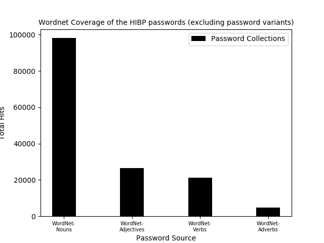
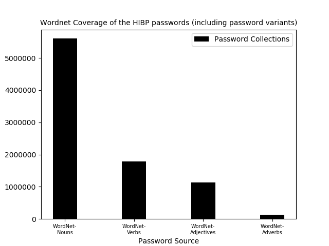
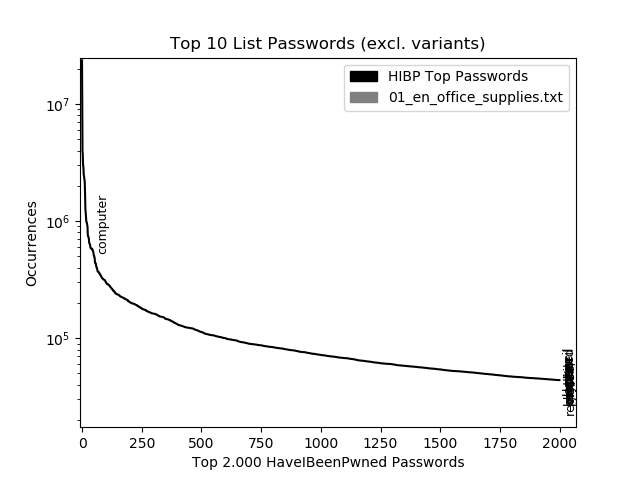
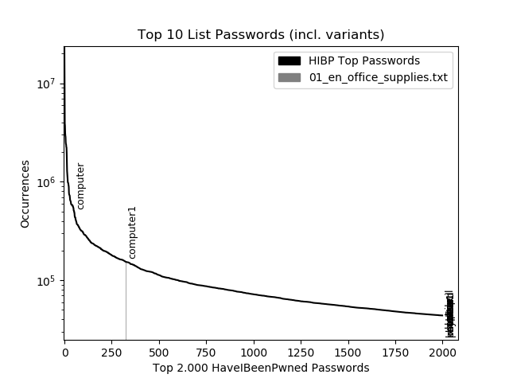

# Inhaltsverzeichnis
1. [Begriffserklärungen](#begriffserklaerungen)
1. [Durchschnittliche Permutationen pro Wordnet Wortart](#avg_permutations_pos)
1. [Trefferquoten (Efficiency) der Passwortquellen für Collection 1](#efficiency_hibp)
1. [Coverage der Wordnet Wortarten für Collection 1](#coverage_wn_hibp)
1. [Verortung der Top 10 Passwörter aus Spartenlisten auf den Top 2000 Passwörtern der Collection 1](#locate_topn_list_pws_hibp)
    * [01_en_office_supplies.txt](#01_en_office_supplies)


## Begriffserklärungen <a name="begriffserklaerungen"></a>

#### Efficiency
Die Trefferquote einer Passwortquelle zu einer gegebenen Referenz, beispielsweise der Collection 1. Eine Efficiency von 95% der Passwortliste X zur Collection 1 würde bedeuten, dass 95% der Passwörter aus Passwortliste X in der Collection 1 gefunden wurden.

Berechnung: (hits(Passwortliste X, Collection 1) / len(Passwortliste X)) * 100

#### Coverage
Die Abdeckungsquote einer Passwortliste X zu einer Referenz. Eine Coverage von 90% der Passwortliste X zur Collection 1 würde bedeuten, dass die Passwörter aus X, die in Collection 1 wiedergefunden wurden, 90% aller Einträge aus Collection 1 ausmachen.

Berechnung: (hits(Passwortliste X, Collection 1) / len(Collection 1)) * 100

#### Performance
Die Performance ist die Anzahl aller Treffer aus einer Passwortliste X zu einer Referenz.

Berechnung: hits(Passwortliste X, Collection 1)

## Durchschnittliche Permutationen pro Lemma pro Wordnet Wortart <a name="avg_permutations_pos"></a>

* Nomen: 224
* Verben : 222
* Adjektive:: 221
* Adverben: 222

## Trefferquoten (Efficiency) der Passwortquellen für Collection 1  <a name="efficiency_hibp"></a>

PWDB-Einträge (Anzahl an Passwörter in HaveIBeenPwned-Passwortliste): 551.509.767. Wenn im Folgenden von der Passwortdatenbank (PWDB) oder der HaveIBeenPwned-Passwortdatei geredet wird, wird die Collection 1 gemeint. Herunterzuladen auf [HaveIBeenPwned](https://haveibeenpwned.com/Passwords).

`Password hits` ist die Anzahl der Treffer der Passwörter dieser Quelle, also alle Passwörter, deren Vorkommnisse in der PWDB > 0 waren.

`Percentage hits` ist die prozentuale Trefferquote dieser Passwortquelle für die HaveIBeenPwned-Passwortdatei, errechnet durch Password hits / PWDB-Einträge * 100, also wie viele Passwörter erfolgreich gefunden werden konnten.

Spartenlisten:

```
[  20200131_10.15.02][+] 01_en_office_supplies.txt (w/o permutations):
        Password hits: 91
        Percentage hits: 2e-05%
[  20200131_10.15.04][+] 01_en_office_supplies.txt (w/ permutations):
        Password hits: 10567
        Percentage hits: 0.00192%
[  20200131_10.15.05][+] 02_en_office_brands.txt (w/o permutations):
        Password hits: 58
        Percentage hits: 1e-05%
[  20200131_10.15.06][+] 02_en_office_brands.txt (w/ permutations):
        Password hits: 4584
        Percentage hits: 0.00083%
[  20200131_10.15.07][+] 03_keyboard_patterns.txt.txt (w/o permutations):
        Password hits: 121
        Percentage hits: 2e-05%
[  20200131_10.15.09][+] 03_keyboard_patterns.txt.txt (w/ permutations):
        Password hits: 10645
        Percentage hits: 0.00193%
[  20200131_10.15.10][+] 05_en_financial_brands.txt (w/o permutations):
        Password hits: 26
        Percentage hits: 0.0%
[  20200131_10.15.11][+] 05_en_financial_brands.txt (w/ permutations):
        Password hits: 1001
        Percentage hits: 0.00018%
[  20200131_10.15.13][+] 06_en_cities.txt (w/o permutations):
        Password hits: 250
        Percentage hits: 5e-05%
[  20200131_10.15.14][+] 06_en_cities.txt (w/ permutations):
        Password hits: 29413
        Percentage hits: 0.00533%
[  20200131_10.15.15][+] 07_first_names.txt (w/o permutations):
        Password hits: 2633
        Percentage hits: 0.00048%
[  20200131_10.15.17][+] 07_first_names.txt (w/ permutations):
        Password hits: 439471
        Percentage hits: 0.07969%
[  20200131_10.15.18][+] 08_last_names.txt (w/o permutations):
        Password hits: 3548
        Percentage hits: 0.00064%
[  20200131_10.15.19][+] 08_last_names.txt (w/ permutations):
        Password hits: 335606
        Percentage hits: 0.06085%
[  20200131_10.15.21][+] 09_en_countries.txt (w/o permutations):
        Password hits: 171
        Percentage hits: 3e-05%
[  20200131_10.15.22][+] 09_en_countries.txt (w/ permutations):
        Password hits: 24097
        Percentage hits: 0.00437%
[  20200131_10.15.23][+] 10_automobile.txt (w/o permutations):
        Password hits: 211
        Percentage hits: 4e-05%
[  20200131_10.15.24][+] 10_automobile.txt (w/ permutations):
        Password hits: 24177
        Percentage hits: 0.00438%
[  20200131_10.15.26][+] 11_software_names.txt (w/o permutations):
        Password hits: 42
        Percentage hits: 1e-05%
[  20200131_10.15.27][+] 11_software_names.txt (w/ permutations):
        Password hits: 1854
        Percentage hits: 0.00034%
[  20200131_10.15.28][+] 12_tech_brands.txt (w/o permutations):
        Password hits: 270
        Percentage hits: 5e-05%
[  20200131_10.15.30][+] 12_tech_brands.txt (w/ permutations):
        Password hits: 26208
        Percentage hits: 0.00475%
[  20200131_10.15.31][+] 13_en_fruit.txt (w/o permutations):
        Password hits: 93
        Percentage hits: 2e-05%
[  20200131_10.15.32][+] 13_en_fruit.txt (w/ permutations):
        Password hits: 9738
        Percentage hits: 0.00177%
[  20200131_10.15.33][+] 14_en_drinks.txt (w/o permutations):
        Password hits: 98
        Percentage hits: 2e-05%
[  20200131_10.15.35][+] 14_en_drinks.txt (w/ permutations):
        Password hits: 7889
        Percentage hits: 0.00143%
[  20200131_10.15.36][+] 15_en_food.txt (w/o permutations):
        Password hits: 75
        Percentage hits: 1e-05%
[  20200131_10.15.37][+] 15_en_food.txt (w/ permutations):
        Password hits: 6434
        Percentage hits: 0.00117%
[  20200131_10.15.39][+] 99_unsortiert.txt (w/o permutations):
        Password hits: 381
        Percentage hits: 7e-05%
[  20200131_10.15.40][+] 99_unsortiert.txt (w/ permutations):
        Password hits: 36505
        Percentage hits: 0.00662%
```

Passwortlisten:
Diese Listen wurden nicht permutiert. Die Einträge wurden in der Collection 1 gesucht und anschließend in der Mongo-Datenbank gespeichert. Deswegen wird hier nur eine Trefferquote pro Liste dargestellt.

```
[  20200131_10.22.46][+] 10-million-password-list-top-500 (w/ permutations):
        Password hits: 500
        Percentage hits: 9e-05%
[  20200131_10.22.46][+] 100k-most-used-passwords-ncsc (w/ permutations):
        Password hits: 99730
        Percentage hits: 0.01808%
[  20200131_10.22.46][+] 10k-most-common (w/ permutations):
        Password hits: 10000
        Percentage hits: 0.00181%
[  20200131_10.22.46][+] cirt-default-passwords (w/ permutations):
        Password hits: 656
        Percentage hits: 0.00012%
[  20200131_10.22.46][+] common-passwords-win (w/ permutations):
        Password hits: 815
        Percentage hits: 0.00015%
[  20200131_10.22.46][+] lizard-squad (w/ permutations):
        Password hits: 11341
        Percentage hits: 0.00206%
[  20200131_10.22.46][+] milw0rm-dictionary (w/ permutations):
        Password hits: 66150
        Percentage hits: 0.01199%
[  20200131_10.22.46][+] top-20-common-ssh-passwords (w/ permutations):
        Password hits: 20
        Percentage hits: 0.0%
[  20200131_10.22.46][+] twitter-banned (w/ permutations):
        Password hits: 396
        Percentage hits: 7e-05%
[  20200131_10.22.51][+] xato-net-10-million-passwords (w/ permutations):
        Password hits: 4030828
        Percentage hits: 0.73087%
[  20200131_10.22.51][+] xato-net-10-million-passwords-100000 (w/ permutations):
        Password hits: 99574
        Percentage hits: 0.01805%
```

Wörterbücher:

```
[  20200131_10.25.18][+] american-english (w/o permutations):
        Password hits: 79536
        Percentage hits: 0.01442%
[  20200131_10.25.30][+] american-english (w/ permutations):
        Password hits: 2960943
        Percentage hits: 0.53688%
[  20200131_10.25.55][+] british-english (w/o permutations):
        Password hits: 78609
        Percentage hits: 0.01425%
[  20200131_10.26.05][+] british-english (w/ permutations):
        Password hits: 2947672
        Percentage hits: 0.53447%
[  20200131_10.26.19][+] cracklib-small (w/o permutations):
        Password hits: 52845
        Percentage hits: 0.00958%
[  20200131_10.26.26][+] cracklib-small (w/ permutations):
        Password hits: 2674594
        Percentage hits: 0.48496%
```

Wordnet:

```
[  20200131_10.32.22][+] Wordnet nouns (w/o permutations):
        Password hits: 98119
        Percentage hits: 0.01779%
[  20200131_10.33.15][+] Wordnet nouns (w/ permutations):
        Password hits: 5603868
        Percentage hits: 1.0161%
[  20200131_10.33.23][+] Wordnet verbs (w/o permutations):
        Password hits: 21367
        Percentage hits: 0.00387%
[  20200131_10.33.29][+] Wordnet verbs (w/ permutations):
        Password hits: 1783023
        Percentage hits: 0.3233%
[  20200131_10.33.38][+] Wordnet adjectives (w/o permutations):
        Password hits: 26523
        Percentage hits: 0.00481%
[  20200131_10.33.45][+] Wordnet adjectives (w/ permutations):
        Password hits: 1138849
        Percentage hits: 0.2065%
[  20200131_10.33.47][+] Wordnet adverbs (w/o permutations):
        Password hits: 4815
        Percentage hits: 0.00087%
[  20200131_10.33.48][+] Wordnet adverbs (w/ permutations):
        Password hits: 131478
        Percentage hits: 0.02384%
```

## Coverage der Wordnet Wortarten für Collection 1 <a name="coverage_wn_hibp"></a>

Ohne Permutationen:

```
[  20200131_10.56.38][+] Note: excluding permutations
[  20200131_10.56.38][+] (0) WordNet Nouns, 98.119, 0.01779 %
[  20200131_10.56.38][+] (1) WordNet Adjectives, 26.523, 0.00481 %
[  20200131_10.56.38][+] (2) WordNet Verbs, 21.367, 0.00387 %
[  20200131_10.56.38][+] (3) WordNet Adverbs, 4.815, 0.00087 %
```


Mit Permutationen:

```
[  20200131_10.59.11][+] Note: including permutations
[  20200131_10.59.11][+] (0) WordNet Nouns, 5.603.868, 1.0161 %
[  20200131_10.59.11][+] (1) WordNet Verbs, 1.783.023, 0.3233 %
[  20200131_10.59.11][+] (2) WordNet Adjectives, 1.138.849, 0.2065 %
[  20200131_10.59.11][+] (3) WordNet Adverbs, 131.478, 0.02384 %
```



## Verortung der Top 10 Passwörter aus Spartenlisten auf den Top 2000 Passwörtern der Collection 1 <a name="locate_topn_list_pws_hibp"></a>

#### Vorarbeit

Das Skript erwartet über `-x/--hibp` einen Pfad zu einer Textdatei, in der die Top X Hashes der Collection 1 absteigend sortiert gespeichert sind. Dafür kann man sich unter [HaveIBeenPwned](https://haveibeenpwned.com/Passwords) unter _ordered by prevalence_ das sortierte Hashfile laden. Anschließen können die ersten X Einträge in ein separates Textfile gespeichert werden mit `tail -n 2000 hibp.txt > hibp_top2000.txt`.

Der Aufruf sieht dann wie folgt aus: `py.exe -Wignore::DeprecationWarning .\finalgraphs.py --hibp .\hibp_top2000`.

#### 01_en_office_supplies.txt <a name="01_en_office_supplies"></a>

Ohne Permutationen:

```
1 - {'name': 'computer', 'occurrences': 486169, 'permutator': 'no_permutator'}
2 - {'name': 'pencil', 'occurrences': 38539, 'permutator': 'no_permutator'}
3 - {'name': 'letter', 'occurrences': 33247, 'permutator': 'no_permutator'}
4 - {'name': 'laptop', 'occurrences': 30300, 'permutator': 'no_permutator'}
5 - {'name': 'mobile', 'occurrences': 29445, 'permutator': 'no_permutator'}
6 - {'name': 'monitor', 'occurrences': 26313, 'permutator': 'no_permutator'}
7 - {'name': 'keyboard', 'occurrences': 24873, 'permutator': 'no_permutator'}
8 - {'name': 'phone', 'occurrences': 24848, 'permutator': 'no_permutator'}
9 - {'name': 'mouse', 'occurrences': 24574, 'permutator': 'no_permutator'}
10 - {'name': 'register', 'occurrences': 20267, 'permutator': 'no_permutator'}
```



Mit Permutationen:

```
1 - {'name': 'computer', 'occurrences': 486169, 'permutator': 'no_permutator'}
2 - {'name': 'computer1', 'occurrences': 153426, 'permutator': 'number'}
3 - {'name': 'pencil', 'occurrences': 38539, 'permutator': 'no_permutator'}
4 - {'name': 'letter', 'occurrences': 33247, 'permutator': 'no_permutator'}
5 - {'name': 'laptop', 'occurrences': 30300, 'permutator': 'no_permutator'}
6 - {'name': 'mobile', 'occurrences': 29445, 'permutator': 'no_permutator'}
7 - {'name': 'mouse1', 'occurrences': 28404, 'permutator': 'number'}
8 - {'name': 'monitor', 'occurrences': 26313, 'permutator': 'no_permutator'}
9 - {'name': 'keyboard', 'occurrences': 24873, 'permutator': 'no_permutator'}
10 - {'name': 'phone', 'occurrences': 24848, 'permutator': 'no_permutator'}
```



#### 01_en_office_supplies.txt <a name="01_en_office_supplies"></a>

Ohne Permutationen:

```

```


Mit Permutationen:

```

```


#### 01_en_office_supplies.txt <a name="01_en_office_supplies"></a>

Ohne Permutationen:

```

```


Mit Permutationen:

```

```


#### 01_en_office_supplies.txt <a name="01_en_office_supplies"></a>

Ohne Permutationen:

```

```


Mit Permutationen:

```

```


#### 01_en_office_supplies.txt <a name="01_en_office_supplies"></a>

Ohne Permutationen:

```

```


Mit Permutationen:

```

```


#### 01_en_office_supplies.txt <a name="01_en_office_supplies"></a>

Ohne Permutationen:

```

```


Mit Permutationen:

```

```

