# Inhaltsverzeichnis
1. [Begriffserklärungen](#begriffserklaerungen)
1. [Durchschnittliche Permutationen pro Wordnet Wortart](#avg_permutations_pos)
1. [Trefferquoten (Efficiency) der Passwortquellen für Collection 1](#efficiency_hibp)
1. [Coverage der Wordnet Wortarten für Collection 1](#coverage_wn_hibp)
1. [Verortung der Top 10 Passwörter aus Spartenlisten auf den Top 2000 Passwörtern der Collection 1](#locate_topn_list_pws_hibp)
    * [01_en_office_supplies.txt](#01_en_office_supplies)
    * [02_en_office_brands.txt](#02_en_office_brands)
    * [03_keyboard_patterns.txt](#03_keyboard_patterns)
    * [05_en_financial_brands.txt](#05_en_financial_brands)
    * [06_en_cities.txt](#06_en_cities)
    * [07_first_names.txt](#07_first_names)
    * [08_last_names.txt](#08_last_names)
    * [09_en_countries.txt](#09_en_countries)
    * [10_automobile.txt](#10_automobile)
    * [11_software_names.txt](#11_software_names)
    * [12_tech_brands.txt](#12_tech_brands)
    * [13_en_fruit.txt](#13_en_fruit)
    * [14_en_drinks.txt](#14_en_drinks)
    * [15_en_food.txt](#15_en_food)
1. [Darstellung der Top 20 Lemmas](#top_20_lemmas)
    * [Nomen](#top_20_lemmas_nomen)
    * [Verben](#top_20_lemmas_verben)
    * [Adjektive](#top_20_lemmas_adjektive)
    * [Adverben](#top_20_lemmas_adverben)
1. [Darstellung der Top 10 Synsets pro Level (nach Gesamtsumme)](#top_10_synsets)
    * [Nomen](#top_10_synsets_nomen)
    * [Verben](#top_10_synsets_verben)
1. [Darstellung der Top 10 Synsets pro Level (nach Synsethits)](#top_10_this_synsets)
    * [Nomen](#top_10_this_synsets_nomen)
    * [Verben](#top_10_this_synsets_verben)


## Begriffserklärungen <a name="begriffserklaerungen"></a>

#### Efficiency
Die Trefferquote einer Passwortquelle zu einer gegebenen Referenz, beispielsweise der Collection 1. Eine Efficiency von 95% der Passwortliste X zur Collection 1 würde bedeuten, dass 95% der Passwörter aus Passwortliste X in der Collection 1 gefunden wurden.

Berechnung: (hits(Passwortliste X, Collection 1) / len(Passwortliste X)) * 100

#### Coverage
Die Abdeckungsquote einer Passwortliste X zu einer Referenz. Eine Coverage von 90% der Passwortliste X zur Collection 1 würde bedeuten, dass die Passwörter aus X, die in Collection 1 wiedergefunden wurden, 90% aller Einträge aus Collection 1 ausmachen.

Berechnung: (hits(Passwortliste X, Collection 1) / len(Collection 1)) * 100

#### Performance
Die Performance ist die Anzahl aller Treffer aus einer Passwortliste X zu einer Referenz.

Berechnung: hits(Passwortliste X, Collection 1)

## Durchschnittliche Permutationen pro Lemma pro Wordnet Wortart <a name="avg_permutations_pos"></a>

* Nomen: 224
* Verben : 222
* Adjektive:: 221
* Adverben: 222

## Trefferquoten (Efficiency) der Passwortquellen für Collection 1  <a name="efficiency_hibp"></a>

PWDB-Einträge (Anzahl an Passwörter in HaveIBeenPwned-Passwortliste): 551.509.767. Wenn im Folgenden von der Passwortdatenbank (PWDB) oder der HaveIBeenPwned-Passwortdatei geredet wird, wird die Collection 1 gemeint. Herunterzuladen auf [HaveIBeenPwned](https://haveibeenpwned.com/Passwords).

`Password hits` ist die Anzahl der Treffer der Passwörter dieser Quelle, also alle Passwörter, deren Vorkommnisse in der PWDB > 0 waren.

`Percentage hits` ist die prozentuale Trefferquote dieser Passwortquelle für die HaveIBeenPwned-Passwortdatei, errechnet durch Password hits / PWDB-Einträge * 100, also wie viele Passwörter erfolgreich gefunden werden konnten.

Spartenlisten:

```
[  20200131_10.15.02][+] 01_en_office_supplies.txt (w/o permutations):
        Password hits: 91
        Percentage hits: 2e-05%
[  20200131_10.15.04][+] 01_en_office_supplies.txt (w/ permutations):
        Password hits: 10567
        Percentage hits: 0.00192%
[  20200131_10.15.05][+] 02_en_office_brands.txt (w/o permutations):
        Password hits: 58
        Percentage hits: 1e-05%
[  20200131_10.15.06][+] 02_en_office_brands.txt (w/ permutations):
        Password hits: 4584
        Percentage hits: 0.00083%
[  20200131_10.15.07][+] 03_keyboard_patterns.txt.txt (w/o permutations):
        Password hits: 121
        Percentage hits: 2e-05%
[  20200131_10.15.09][+] 03_keyboard_patterns.txt.txt (w/ permutations):
        Password hits: 10645
        Percentage hits: 0.00193%
[  20200131_10.15.10][+] 05_en_financial_brands.txt (w/o permutations):
        Password hits: 26
        Percentage hits: 0.0%
[  20200131_10.15.11][+] 05_en_financial_brands.txt (w/ permutations):
        Password hits: 1001
        Percentage hits: 0.00018%
[  20200131_10.15.13][+] 06_en_cities.txt (w/o permutations):
        Password hits: 250
        Percentage hits: 5e-05%
[  20200131_10.15.14][+] 06_en_cities.txt (w/ permutations):
        Password hits: 29413
        Percentage hits: 0.00533%
[  20200131_10.15.15][+] 07_first_names.txt (w/o permutations):
        Password hits: 2633
        Percentage hits: 0.00048%
[  20200131_10.15.17][+] 07_first_names.txt (w/ permutations):
        Password hits: 439471
        Percentage hits: 0.07969%
[  20200131_10.15.18][+] 08_last_names.txt (w/o permutations):
        Password hits: 3548
        Percentage hits: 0.00064%
[  20200131_10.15.19][+] 08_last_names.txt (w/ permutations):
        Password hits: 335606
        Percentage hits: 0.06085%
[  20200131_10.15.21][+] 09_en_countries.txt (w/o permutations):
        Password hits: 171
        Percentage hits: 3e-05%
[  20200131_10.15.22][+] 09_en_countries.txt (w/ permutations):
        Password hits: 24097
        Percentage hits: 0.00437%
[  20200131_10.15.23][+] 10_automobile.txt (w/o permutations):
        Password hits: 211
        Percentage hits: 4e-05%
[  20200131_10.15.24][+] 10_automobile.txt (w/ permutations):
        Password hits: 24177
        Percentage hits: 0.00438%
[  20200131_10.15.26][+] 11_software_names.txt (w/o permutations):
        Password hits: 42
        Percentage hits: 1e-05%
[  20200131_10.15.27][+] 11_software_names.txt (w/ permutations):
        Password hits: 1854
        Percentage hits: 0.00034%
[  20200131_10.15.28][+] 12_tech_brands.txt (w/o permutations):
        Password hits: 270
        Percentage hits: 5e-05%
[  20200131_10.15.30][+] 12_tech_brands.txt (w/ permutations):
        Password hits: 26208
        Percentage hits: 0.00475%
[  20200131_10.15.31][+] 13_en_fruit.txt (w/o permutations):
        Password hits: 93
        Percentage hits: 2e-05%
[  20200131_10.15.32][+] 13_en_fruit.txt (w/ permutations):
        Password hits: 9738
        Percentage hits: 0.00177%
[  20200131_10.15.33][+] 14_en_drinks.txt (w/o permutations):
        Password hits: 98
        Percentage hits: 2e-05%
[  20200131_10.15.35][+] 14_en_drinks.txt (w/ permutations):
        Password hits: 7889
        Percentage hits: 0.00143%
[  20200131_10.15.36][+] 15_en_food.txt (w/o permutations):
        Password hits: 75
        Percentage hits: 1e-05%
[  20200131_10.15.37][+] 15_en_food.txt (w/ permutations):
        Password hits: 6434
        Percentage hits: 0.00117%
[  20200131_10.15.39][+] 99_unsortiert.txt (w/o permutations):
        Password hits: 381
        Percentage hits: 7e-05%
[  20200131_10.15.40][+] 99_unsortiert.txt (w/ permutations):
        Password hits: 36505
        Percentage hits: 0.00662%
```

Passwortlisten:
Diese Listen wurden nicht permutiert. Die Einträge wurden in der Collection 1 gesucht und anschließend in der Mongo-Datenbank gespeichert. Deswegen wird hier nur eine Trefferquote pro Liste dargestellt.

```
[  20200131_10.22.46][+] 10-million-password-list-top-500 (w/ permutations):
        Password hits: 500
        Percentage hits: 9e-05%
[  20200131_10.22.46][+] 100k-most-used-passwords-ncsc (w/ permutations):
        Password hits: 99730
        Percentage hits: 0.01808%
[  20200131_10.22.46][+] 10k-most-common (w/ permutations):
        Password hits: 10000
        Percentage hits: 0.00181%
[  20200131_10.22.46][+] cirt-default-passwords (w/ permutations):
        Password hits: 656
        Percentage hits: 0.00012%
[  20200131_10.22.46][+] common-passwords-win (w/ permutations):
        Password hits: 815
        Percentage hits: 0.00015%
[  20200131_10.22.46][+] lizard-squad (w/ permutations):
        Password hits: 11341
        Percentage hits: 0.00206%
[  20200131_10.22.46][+] milw0rm-dictionary (w/ permutations):
        Password hits: 66150
        Percentage hits: 0.01199%
[  20200131_10.22.46][+] top-20-common-ssh-passwords (w/ permutations):
        Password hits: 20
        Percentage hits: 0.0%
[  20200131_10.22.46][+] twitter-banned (w/ permutations):
        Password hits: 396
        Percentage hits: 7e-05%
[  20200131_10.22.51][+] xato-net-10-million-passwords (w/ permutations):
        Password hits: 4030828
        Percentage hits: 0.73087%
[  20200131_10.22.51][+] xato-net-10-million-passwords-100000 (w/ permutations):
        Password hits: 99574
        Percentage hits: 0.01805%
```

Wörterbücher:

```
[  20200131_10.25.18][+] american-english (w/o permutations):
        Password hits: 79536
        Percentage hits: 0.01442%
[  20200131_10.25.30][+] american-english (w/ permutations):
        Password hits: 2960943
        Percentage hits: 0.53688%
[  20200131_10.25.55][+] british-english (w/o permutations):
        Password hits: 78609
        Percentage hits: 0.01425%
[  20200131_10.26.05][+] british-english (w/ permutations):
        Password hits: 2947672
        Percentage hits: 0.53447%
[  20200131_10.26.19][+] cracklib-small (w/o permutations):
        Password hits: 52845
        Percentage hits: 0.00958%
[  20200131_10.26.26][+] cracklib-small (w/ permutations):
        Password hits: 2674594
        Percentage hits: 0.48496%
```

Wordnet:

```
[  20200131_10.32.22][+] Wordnet nouns (w/o permutations):
        Password hits: 98119
        Percentage hits: 0.01779%
[  20200131_10.33.15][+] Wordnet nouns (w/ permutations):
        Password hits: 5603868
        Percentage hits: 1.0161%
[  20200131_10.33.23][+] Wordnet verbs (w/o permutations):
        Password hits: 21367
        Percentage hits: 0.00387%
[  20200131_10.33.29][+] Wordnet verbs (w/ permutations):
        Password hits: 1783023
        Percentage hits: 0.3233%
[  20200131_10.33.38][+] Wordnet adjectives (w/o permutations):
        Password hits: 26523
        Percentage hits: 0.00481%
[  20200131_10.33.45][+] Wordnet adjectives (w/ permutations):
        Password hits: 1138849
        Percentage hits: 0.2065%
[  20200131_10.33.47][+] Wordnet adverbs (w/o permutations):
        Password hits: 4815
        Percentage hits: 0.00087%
[  20200131_10.33.48][+] Wordnet adverbs (w/ permutations):
        Password hits: 131478
        Percentage hits: 0.02384%
```

## Coverage der Wordnet Wortarten für Collection 1 <a name="coverage_wn_hibp"></a>

Ohne Permutationen:

```
[  20200131_10.56.38][+] Note: excluding permutations
[  20200131_10.56.38][+] (0) WordNet Nouns, 98.119, 0.01779 %
[  20200131_10.56.38][+] (1) WordNet Adjectives, 26.523, 0.00481 %
[  20200131_10.56.38][+] (2) WordNet Verbs, 21.367, 0.00387 %
[  20200131_10.56.38][+] (3) WordNet Adverbs, 4.815, 0.00087 %
```


Mit Permutationen:

```
[  20200131_10.59.11][+] Note: including permutations
[  20200131_10.59.11][+] (0) WordNet Nouns, 5.603.868, 1.0161 %
[  20200131_10.59.11][+] (1) WordNet Verbs, 1.783.023, 0.3233 %
[  20200131_10.59.11][+] (2) WordNet Adjectives, 1.138.849, 0.2065 %
[  20200131_10.59.11][+] (3) WordNet Adverbs, 131.478, 0.02384 %
```


## Verortung der Top 10 Passwörter aus Spartenlisten auf den Top 2000 Passwörtern der Collection 1 <a name="locate_topn_list_pws_hibp"></a>

#### Vorarbeit

Das Skript erwartet über `-x/--hibp` einen Pfad zu einer Textdatei, in der die Top X Hashes der Collection 1 absteigend sortiert gespeichert sind. Dafür kann man sich unter [HaveIBeenPwned](https://haveibeenpwned.com/Passwords) unter _ordered by prevalence_ das sortierte Hashfile laden. Anschließen können die ersten X Einträge in ein separates Textfile gespeichert werden mit `tail -n 2000 hibp.txt > hibp_top2000.txt`.

Der Aufruf sieht dann wie folgt aus: `py.exe -Wignore::DeprecationWarning .\finalgraphs.py --hibp .\hibp_top2000`.

#### 01_en_office_supplies.txt <a name="01_en_office_supplies"></a>

Ohne Permutationen:

```
1 - {'name': 'computer', 'occurrences': 486169, 'permutator': 'no_permutator'}
2 - {'name': 'pencil', 'occurrences': 38539, 'permutator': 'no_permutator'}
3 - {'name': 'letter', 'occurrences': 33247, 'permutator': 'no_permutator'}
4 - {'name': 'laptop', 'occurrences': 30300, 'permutator': 'no_permutator'}
5 - {'name': 'mobile', 'occurrences': 29445, 'permutator': 'no_permutator'}
6 - {'name': 'monitor', 'occurrences': 26313, 'permutator': 'no_permutator'}
7 - {'name': 'keyboard', 'occurrences': 24873, 'permutator': 'no_permutator'}
8 - {'name': 'phone', 'occurrences': 24848, 'permutator': 'no_permutator'}
9 - {'name': 'mouse', 'occurrences': 24574, 'permutator': 'no_permutator'}
10 - {'name': 'register', 'occurrences': 20267, 'permutator': 'no_permutator'}
```


Mit Permutationen:

```
1 - {'name': 'computer', 'occurrences': 486169, 'permutator': 'no_permutator'}
2 - {'name': 'computer1', 'occurrences': 153426, 'permutator': 'number'}
3 - {'name': 'pencil', 'occurrences': 38539, 'permutator': 'no_permutator'}
4 - {'name': 'letter', 'occurrences': 33247, 'permutator': 'no_permutator'}
5 - {'name': 'laptop', 'occurrences': 30300, 'permutator': 'no_permutator'}
6 - {'name': 'mobile', 'occurrences': 29445, 'permutator': 'no_permutator'}
7 - {'name': 'mouse1', 'occurrences': 28404, 'permutator': 'number'}
8 - {'name': 'monitor', 'occurrences': 26313, 'permutator': 'no_permutator'}
9 - {'name': 'keyboard', 'occurrences': 24873, 'permutator': 'no_permutator'}
10 - {'name': 'phone', 'occurrences': 24848, 'permutator': 'no_permutator'}
```


#### 02_en_office_brands.txt <a name="02_en_office_brands"></a>

Ohne Permutationen:

```
1 - {'name': 'brother', 'occurrences': 45661, 'permutator': 'no_permutator'}
2 - {'name': 'universal', 'occurrences': 28772, 'permutator': 'no_permutator'}
3 - {'name': 'lexmark', 'occurrences': 20947, 'permutator': 'no_permutator'}
4 - {'name': 'staples', 'occurrences': 8117, 'permutator': 'no_permutator'}
5 - {'name': 'canon', 'occurrences': 7941, 'permutator': 'no_permutator'}
6 - {'name': 'sharpie', 'occurrences': 7635, 'permutator': 'no_permutator'}
7 - {'name': 'pilot', 'occurrences': 6457, 'permutator': 'no_permutator'}
8 - {'name': 'avery', 'occurrences': 6069, 'permutator': 'no_permutator'}
9 - {'name': 'primera', 'occurrences': 4584, 'permutator': 'no_permutator'}
10 - {'name': 'epson', 'occurrences': 4248, 'permutator': 'no_permutator'}
```

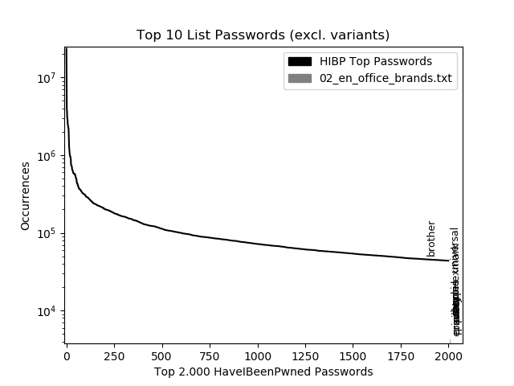

Mit Permutationen:

```
1 - {'name': 'brother', 'occurrences': 45661, 'permutator': 'no_permutator'}
2 - {'name': 'brother1', 'occurrences': 30874, 'permutator': 'number'}
3 - {'name': 'universal', 'occurrences': 28772, 'permutator': 'no_permutator'}
4 - {'name': 'lexmark', 'occurrences': 20947, 'permutator': 'no_permutator'}
5 - {'name': 'lexmark1', 'occurrences': 13123, 'permutator': 'number'}
6 - {'name': 'sharpie1', 'occurrences': 11576, 'permutator': 'number'}
7 - {'name': 'avery1', 'occurrences': 11133, 'permutator': 'number'}
8 - {'name': 'universal1', 'occurrences': 10451, 'permutator': 'number'}
9 - {'name': 'staples', 'occurrences': 8117, 'permutator': 'no_permutator'}
10 - {'name': 'canon', 'occurrences': 7941, 'permutator': 'no_permutator'}
```

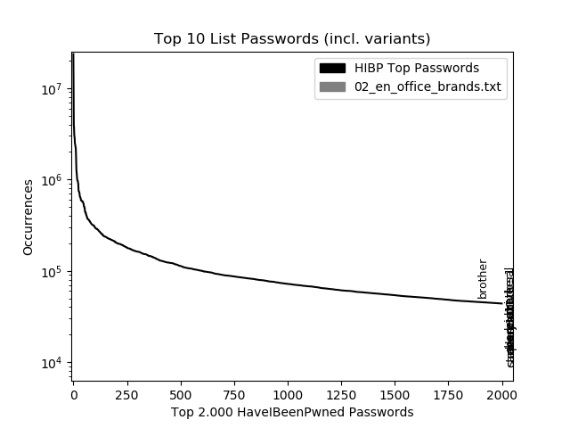

#### 03_keyboard_patterns.txt <a name="03_keyboard_patterns"></a>

Ohne Permutationen:

```
1 - {'name': '123456', 'occurrences': 23547453, 'permutator': 'no_permutator'}
2 - {'name': '123456789', 'occurrences': 7799814, 'permutator': 'no_permutator'}
3 - {'name': 'qwerty', 'occurrences': 3912816, 'permutator': 'no_permutator'}
4 - {'name': '12345678', 'occurrences': 2938594, 'permutator': 'no_permutator'}
5 - {'name': '1234567', 'occurrences': 2512537, 'permutator': 'no_permutator'}
6 - {'name': '12345', 'occurrences': 2380800, 'permutator': 'no_permutator'}
7 - {'name': '1234567890', 'occurrences': 2250015, 'permutator': 'no_permutator'}
8 - {'name': '1234', 'occurrences': 1289385, 'permutator': 'no_permutator'}
9 - {'name': 'qwertyuiop', 'occurrences': 1098172, 'permutator': 'no_permutator'}
10 - {'name': '123', 'occurrences': 1038635, 'permutator': 'no_permutator'}
```

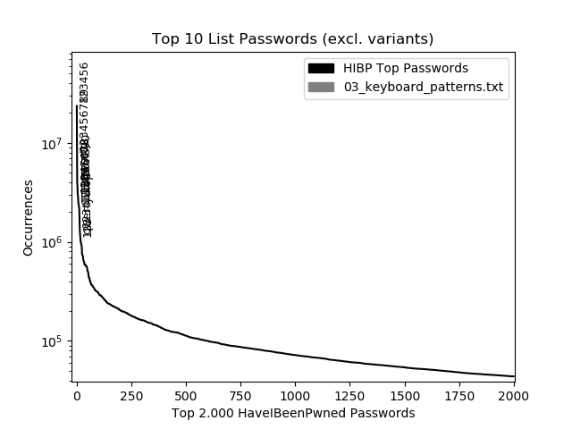

Mit Permutationen:

```
1 - {'name': '123456', 'occurrences': 23547453, 'permutator': 'no_permutator'}
2 - {'name': '123456789', 'occurrences': 7799814, 'permutator': 'no_permutator'}
3 - {'name': 'qwerty', 'occurrences': 3912816, 'permutator': 'no_permutator'}
4 - {'name': '12345678', 'occurrences': 2938594, 'permutator': 'no_permutator'}
5 - {'name': '1234567', 'occurrences': 2512537, 'permutator': 'no_permutator'}
6 - {'name': '12345', 'occurrences': 2380800, 'permutator': 'no_permutator'}
7 - {'name': '1234567890', 'occurrences': 2250015, 'permutator': 'no_permutator'}
8 - {'name': '123123', 'occurrences': 2230508, 'permutator': 'num_seq_suffix'}
9 - {'name': '1234', 'occurrences': 1289385, 'permutator': 'no_permutator'}
10 - {'name': 'qwertyuiop', 'occurrences': 1098172, 'permutator': 'no_permutator'}
```


#### 05_en_financial_brands.txt <a name="05_en_financial_brands"></a>

Ohne Permutationen:

```
1 - {'name': 'mastercard', 'occurrences': 4097, 'permutator': 'no_permutator'}
2 - {'name': 'visa', 'occurrences': 2257, 'permutator': 'no_permutator'}
3 - {'name': 'lloyds', 'occurrences': 1791, 'permutator': 'no_permutator'}
4 - {'name': 'comerica', 'occurrences': 368, 'permutator': 'no_permutator'}
5 - {'name': 'citigroup', 'occurrences': 341, 'permutator': 'no_permutator'}
6 - {'name': 'amex', 'occurrences': 288, 'permutator': 'no_permutator'}
7 - {'name': 'americanexpress', 'occurrences': 169, 'permutator': 'no_permutator'}
8 - {'name': "macy's", 'occurrences': 89, 'permutator': 'no_permutator'}
9 - {'name': 'stifel', 'occurrences': 85, 'permutator': 'no_permutator'}
10 - {'name': 'ubs', 'occurrences': 84, 'permutator': 'no_permutator'}
```

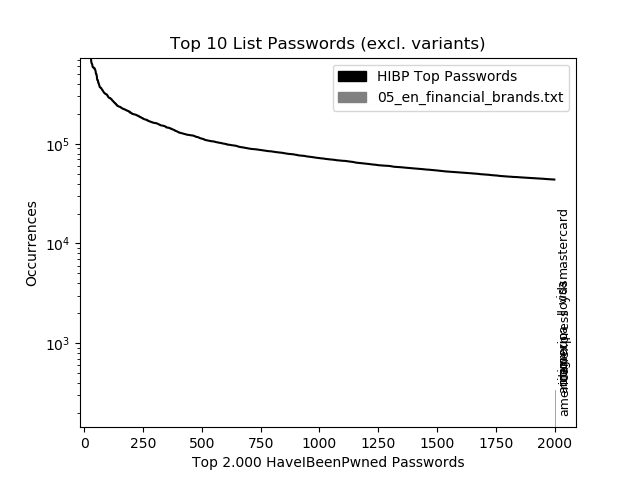

Mit Permutationen:

```
1 - {'name': 'mastercard', 'occurrences': 4097, 'permutator': 'no_permutator'}
2 - {'name': 'visa', 'occurrences': 2257, 'permutator': 'no_permutator'}
3 - {'name': 'lloyds', 'occurrences': 1791, 'permutator': 'no_permutator'}
4 - {'name': 'visavisa', 'occurrences': 849, 'permutator': 'duplicate'}
5 - {'name': 'visa123', 'occurrences': 613, 'permutator': 'num_seq_suffix'}
6 - {'name': 'lloyds1', 'occurrences': 552, 'permutator': 'number'}
7 - {'name': 'visa1234', 'occurrences': 506, 'permutator': 'num_seq_suffix'}
8 - {'name': 'amex123', 'occurrences': 428, 'permutator': 'num_seq_suffix'}
9 - {'name': 'mastercard1', 'occurrences': 412, 'permutator': 'number'}
10 - {'name': 'visa14', 'occurrences': 369, 'permutator': 'number'}
```


#### 06_en_cities.txt <a name="06_en_cities"></a>

Ohne Permutationen:

```
1 - {'name': 'orange', 'occurrences': 192223, 'permutator': 'no_permutator'}
2 - {'name': 'elizabeth', 'occurrences': 158090, 'permutator': 'no_permutator'}
3 - {'name': 'jackson', 'occurrences': 145403, 'permutator': 'no_permutator'}
4 - {'name': 'austin', 'occurrences': 145321, 'permutator': 'no_permutator'}
5 - {'name': 'madison', 'occurrences': 143933, 'permutator': 'no_permutator'}
6 - {'name': 'phoenix', 'occurrences': 111645, 'permutator': 'no_permutator'}
7 - {'name': 'dallas', 'occurrences': 108146, 'permutator': 'no_permutator'}
8 - {'name': 'manchester', 'occurrences': 100469, 'permutator': 'no_permutator'}
9 - {'name': 'charlotte', 'occurrences': 95990, 'permutator': 'no_permutator'}
10 - {'name': 'chicago', 'occurrences': 77591, 'permutator': 'no_permutator'}
```

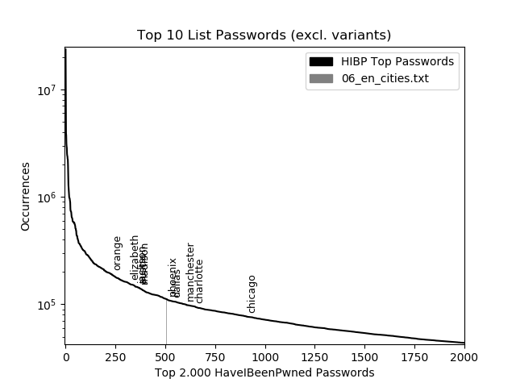

Mit Permutationen:

```
1 - {'name': 'orange', 'occurrences': 192223, 'permutator': 'no_permutator'}
2 - {'name': 'elizabeth', 'occurrences': 158090, 'permutator': 'no_permutator'}
3 - {'name': 'jackson', 'occurrences': 145403, 'permutator': 'no_permutator'}
4 - {'name': 'austin', 'occurrences': 145321, 'permutator': 'no_permutator'}
5 - {'name': 'madison', 'occurrences': 143933, 'permutator': 'no_permutator'}
6 - {'name': 'madison1', 'occurrences': 123467, 'permutator': 'number'}
7 - {'name': 'elizabeth1', 'occurrences': 122225, 'permutator': 'number'}
8 - {'name': 'phoenix', 'occurrences': 111645, 'permutator': 'no_permutator'}
9 - {'name': 'dallas', 'occurrences': 108146, 'permutator': 'no_permutator'}
10 - {'name': 'manchester', 'occurrences': 100469, 'permutator': 'no_permutator'}
```


#### 07_first_names.txt <a name="07_first_names.txt"></a>

Ohne Permutationen:

```
1 - {'name': 'princess', 'occurrences': 484475, 'permutator': 'no_permutator'}
2 - {'name': 'ashley', 'occurrences': 438401, 'permutator': 'no_permutator'}
3 - {'name': 'michael', 'occurrences': 431329, 'permutator': 'no_permutator'}
4 - {'name': 'daniel', 'occurrences': 373779, 'permutator': 'no_permutator'}
5 - {'name': 'jessica', 'occurrences': 328107, 'permutator': 'no_permutator'}
6 - {'name': 'charlie', 'occurrences': 313155, 'permutator': 'no_permutator'}
7 - {'name': 'jordan', 'occurrences': 302131, 'permutator': 'no_permutator'}
8 - {'name': 'thomas', 'occurrences': 288418, 'permutator': 'no_permutator'}
9 - {'name': 'michelle', 'occurrences': 283319, 'permutator': 'no_permutator'}
10 - {'name': 'nicole', 'occurrences': 282511, 'permutator': 'no_permutator'}
```

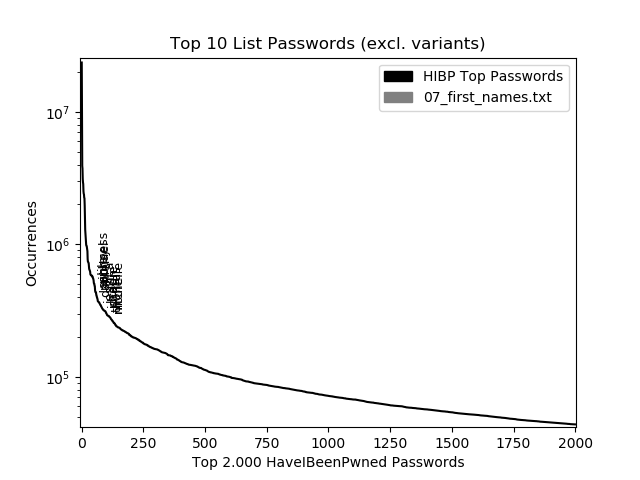

Mit Permutationen:

```
1 - {'name': 'princess', 'occurrences': 484475, 'permutator': 'no_permutator'}
2 - {'name': 'ashley', 'occurrences': 438401, 'permutator': 'no_permutator'}
3 - {'name': 'michael', 'occurrences': 431329, 'permutator': 'no_permutator'}
4 - {'name': 'daniel', 'occurrences': 373779, 'permutator': 'no_permutator'}
5 - {'name': 'princess1', 'occurrences': 365068, 'permutator': 'number'}
6 - {'name': 'jordan23', 'occurrences': 330482, 'permutator': 'number'}
7 - {'name': 'jessica', 'occurrences': 328107, 'permutator': 'no_permutator'}
8 - {'name': 'charlie', 'occurrences': 313155, 'permutator': 'no_permutator'}
9 - {'name': 'jordan', 'occurrences': 302131, 'permutator': 'no_permutator'}
10 - {'name': 'michael1', 'occurrences': 297972, 'permutator': 'number'}
```


#### 08_last_names.txt <a name="08_last_namestxt"></a>

Ohne Permutationen:

```
1 - {'name': 'ashley', 'occurrences': 438401, 'permutator': 'no_permutator'}
2 - {'name': 'michael', 'occurrences': 431329, 'permutator': 'no_permutator'}
3 - {'name': 'daniel', 'occurrences': 373779, 'permutator': 'no_permutator'}
4 - {'name': 'love', 'occurrences': 347508, 'permutator': 'no_permutator'}
5 - {'name': 'jordan', 'occurrences': 302131, 'permutator': 'no_permutator'}
6 - {'name': 'thomas', 'occurrences': 288418, 'permutator': 'no_permutator'}
7 - {'name': 'anthony', 'occurrences': 262492, 'permutator': 'no_permutator'}
8 - {'name': 'hunter', 'occurrences': 246847, 'permutator': 'no_permutator'}
9 - {'name': 'george', 'occurrences': 218313, 'permutator': 'no_permutator'}
10 - {'name': 'alexander', 'occurrences': 198825, 'permutator': 'no_permutator'}
```

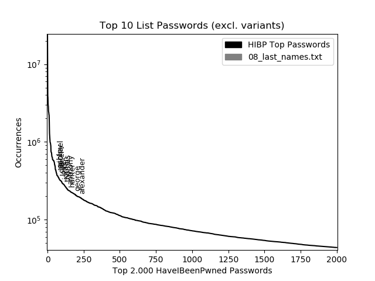

Mit Permutationen:

```
1 - {'name': 'ashley', 'occurrences': 438401, 'permutator': 'no_permutator'}
2 - {'name': 'michael', 'occurrences': 431329, 'permutator': 'no_permutator'}
3 - {'name': 'daniel', 'occurrences': 373779, 'permutator': 'no_permutator'}
4 - {'name': 'love', 'occurrences': 347508, 'permutator': 'no_permutator'}
5 - {'name': 'love123', 'occurrences': 334811, 'permutator': 'num_seq_suffix'}
6 - {'name': 'jordan23', 'occurrences': 330482, 'permutator': 'number'}
7 - {'name': 'jordan', 'occurrences': 302131, 'permutator': 'no_permutator'}
8 - {'name': 'michael1', 'occurrences': 297972, 'permutator': 'number'}
9 - {'name': 'thomas', 'occurrences': 288418, 'permutator': 'no_permutator'}
10 - {'name': 'anthony', 'occurrences': 262492, 'permutator': 'no_permutator'}
```

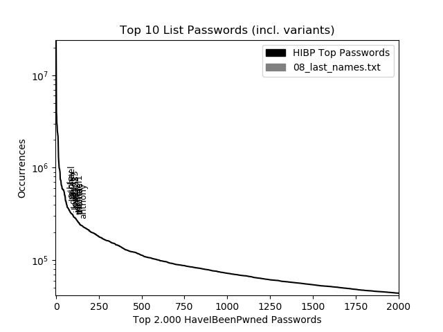

#### 09_en_countries.txt <a name="09_en_countries"></a>

Ohne Permutationen:

```
1 - {'name': 'jordan', 'occurrences': 302131, 'permutator': 'no_permutator'}
2 - {'name': 'pakistan', 'occurrences': 213382, 'permutator': 'no_permutator'}
3 - {'name': 'canada', 'occurrences': 116776, 'permutator': 'no_permutator'}
4 - {'name': 'mexico', 'occurrences': 96438, 'permutator': 'no_permutator'}
5 - {'name': 'portugal', 'occurrences': 78757, 'permutator': 'no_permutator'}
6 - {'name': 'australia', 'occurrences': 65498, 'permutator': 'no_permutator'}
7 - {'name': 'france', 'occurrences': 60564, 'permutator': 'no_permutator'}
8 - {'name': 'jamaica', 'occurrences': 59498, 'permutator': 'no_permutator'}
9 - {'name': 'georgia', 'occurrences': 58307, 'permutator': 'no_permutator'}
10 - {'name': 'india', 'occurrences': 52453, 'permutator': 'no_permutator'}
```

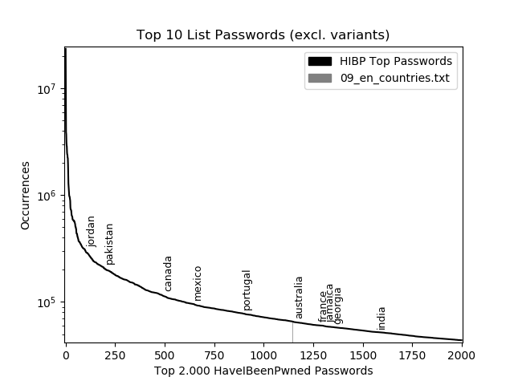

Mit Permutationen:

```
1 - {'name': 'jordan23', 'occurrences': 330482, 'permutator': 'number'}
2 - {'name': 'jordan', 'occurrences': 302131, 'permutator': 'no_permutator'}
3 - {'name': 'pakistan', 'occurrences': 213382, 'permutator': 'no_permutator'}
4 - {'name': 'jordan1', 'occurrences': 183075, 'permutator': 'number'}
5 - {'name': 'canada', 'occurrences': 116776, 'permutator': 'no_permutator'}
6 - {'name': 'mexico1', 'occurrences': 112649, 'permutator': 'number'}
7 - {'name': 'mexico', 'occurrences': 96438, 'permutator': 'no_permutator'}
8 - {'name': 'portugal', 'occurrences': 78757, 'permutator': 'no_permutator'}
9 - {'name': 'australia', 'occurrences': 65498, 'permutator': 'no_permutator'}
10 - {'name': 'france', 'occurrences': 60564, 'permutator': 'no_permutator'}
```

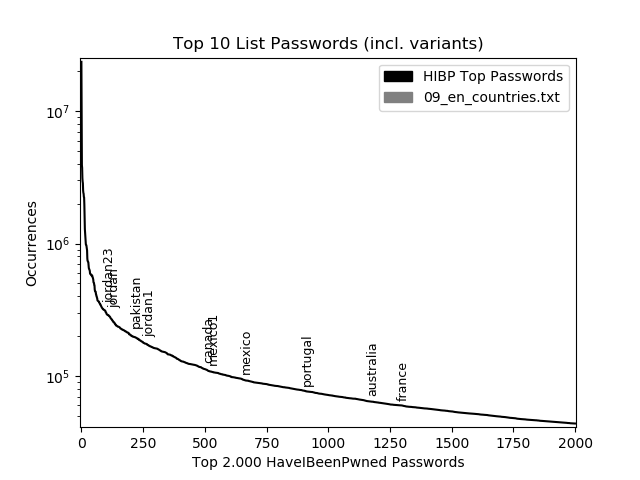

#### 10_automobile.txt <a name="10_automobile"></a>

Ohne Permutationen:

```
1 - {'name': 'mercedes', 'occurrences': 164063, 'permutator': 'no_permutator'}
2 - {'name': 'prince', 'occurrences': 158276, 'permutator': 'no_permutator'}
3 - {'name': 'ferrari', 'occurrences': 139216, 'permutator': 'no_permutator'}
4 - {'name': 'yamaha', 'occurrences': 126493, 'permutator': 'no_permutator'}
5 - {'name': 'toyota', 'occurrences': 96526, 'permutator': 'no_permutator'}
6 - {'name': 'porsche', 'occurrences': 70520, 'permutator': 'no_permutator'}
7 - {'name': 'nissan', 'occurrences': 69780, 'permutator': 'no_permutator'}
8 - {'name': 'jaguar', 'occurrences': 63247, 'permutator': 'no_permutator'}
9 - {'name': 'suzuki', 'occurrences': 57846, 'permutator': 'no_permutator'}
10 - {'name': 'general', 'occurrences': 44617, 'permutator': 'no_permutator'}
```

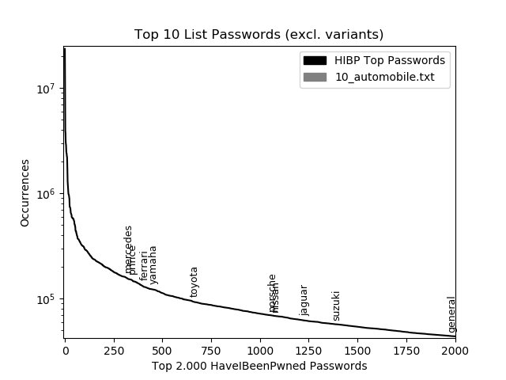

Mit Permutationen:

```
1 - {'name': 'mercedes', 'occurrences': 164063, 'permutator': 'no_permutator'}
2 - {'name': 'prince', 'occurrences': 158276, 'permutator': 'no_permutator'}
3 - {'name': 'ferrari', 'occurrences': 139216, 'permutator': 'no_permutator'}
4 - {'name': 'yamaha', 'occurrences': 126493, 'permutator': 'no_permutator'}
5 - {'name': 'toyota', 'occurrences': 96526, 'permutator': 'no_permutator'}
6 - {'name': 'porsche', 'occurrences': 70520, 'permutator': 'no_permutator'}
7 - {'name': 'nissan', 'occurrences': 69780, 'permutator': 'no_permutator'}
8 - {'name': 'jaguar', 'occurrences': 63247, 'permutator': 'no_permutator'}
9 - {'name': 'suzuki', 'occurrences': 57846, 'permutator': 'no_permutator'}
10 - {'name': 'honda1', 'occurrences': 55011, 'permutator': 'number'}
```

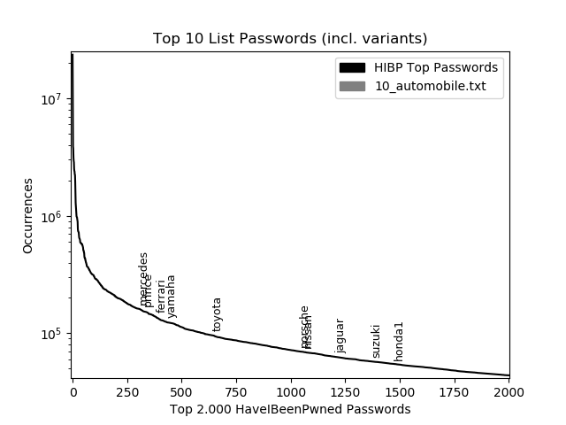

#### 11_software_names.txt <a name="11_software_names"></a>

Ohne Permutationen:

```
1 - {'name': 'minecraft', 'occurrences': 53281, 'permutator': 'no_permutator'}
2 - {'name': 'midori', 'occurrences': 6953, 'permutator': 'no_permutator'}
3 - {'name': 'solitaire', 'occurrences': 5661, 'permutator': 'no_permutator'}
4 - {'name': 'encarta', 'occurrences': 2096, 'permutator': 'no_permutator'}
5 - {'name': 'midas', 'occurrences': 1612, 'permutator': 'no_permutator'}
6 - {'name': 'skype', 'occurrences': 1324, 'permutator': 'no_permutator'}
7 - {'name': 'havok', 'occurrences': 1077, 'permutator': 'no_permutator'}
8 - {'name': 'msn', 'occurrences': 939, 'permutator': 'no_permutator'}
9 - {'name': 'singularity', 'occurrences': 825, 'permutator': 'no_permutator'}
10 - {'name': 'directx', 'occurrences': 489, 'permutator': 'no_permutator'}
```

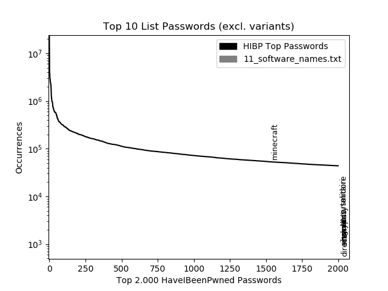

Mit Permutationen:

```
1 - {'name': 'minecraft', 'occurrences': 53281, 'permutator': 'no_permutator'}
2 - {'name': 'windows7', 'occurrences': 18956, 'permutator': 'sc_cc'}
3 - {'name': 'windows98', 'occurrences': 9198, 'permutator': 'sc_cc'}
4 - {'name': 'Minecraft', 'occurrences': 8068, 'permutator': 'uppercase_index_char'}
5 - {'name': 'midori', 'occurrences': 6953, 'permutator': 'no_permutator'}
6 - {'name': 'minecraft123', 'occurrences': 6942, 'permutator': 'num_seq_suffix'}
7 - {'name': 'minecraft1', 'occurrences': 6448, 'permutator': 'number'}
8 - {'name': 'solitaire', 'occurrences': 5661, 'permutator': 'no_permutator'}
9 - {'name': 'windows8', 'occurrences': 3152, 'permutator': 'sc_cc'}
10 - {'name': 'msn123', 'occurrences': 2984, 'permutator': 'num_seq_suffix'}
```

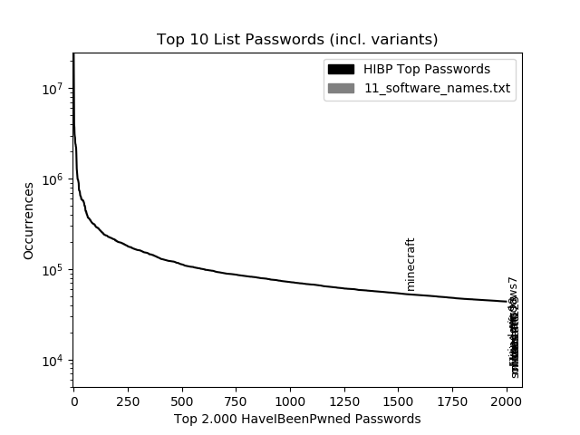

#### 12_tech_brands.txt <a name="12_tech_brands"></a>

Ohne Permutationen:

```
1 - {'name': 'samsung', 'occurrences': 315721, 'permutator': 'no_permutator'}
2 - {'name': 'andrew', 'occurrences': 265776, 'permutator': 'no_permutator'}
3 - {'name': 'apple', 'occurrences': 228761, 'permutator': 'no_permutator'}
4 - {'name': 'google', 'occurrences': 186782, 'permutator': 'no_permutator'}
5 - {'name': 'victor', 'occurrences': 126061, 'permutator': 'no_permutator'}
6 - {'name': 'cherry', 'occurrences': 98069, 'permutator': 'no_permutator'}
7 - {'name': 'creative', 'occurrences': 95809, 'permutator': 'no_permutator'}
8 - {'name': 'compaq', 'occurrences': 91203, 'permutator': 'no_permutator'}
9 - {'name': 'motorola', 'occurrences': 79140, 'permutator': 'no_permutator'}
10 - {'name': 'gateway', 'occurrences': 69714, 'permutator': 'no_permutator'}
```

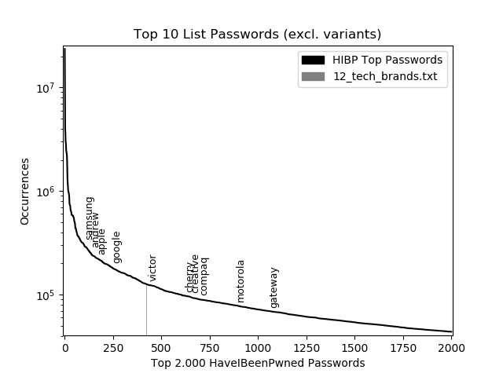

Mit Permutationen:

```
1 - {'name': 'samsung', 'occurrences': 315721, 'permutator': 'no_permutator'}
2 - {'name': 'andrew', 'occurrences': 265776, 'permutator': 'no_permutator'}
3 - {'name': 'apple', 'occurrences': 228761, 'permutator': 'no_permutator'}
4 - {'name': 'google', 'occurrences': 186782, 'permutator': 'no_permutator'}
5 - {'name': 'andrew1', 'occurrences': 145597, 'permutator': 'number'}
6 - {'name': 'victor', 'occurrences': 126061, 'permutator': 'no_permutator'}
7 - {'name': 'cherry', 'occurrences': 98069, 'permutator': 'no_permutator'}
8 - {'name': 'apple1', 'occurrences': 97817, 'permutator': 'number'}
9 - {'name': 'creative', 'occurrences': 95809, 'permutator': 'no_permutator'}
10 - {'name': 'compaq', 'occurrences': 91203, 'permutator': 'no_permutator'}
```

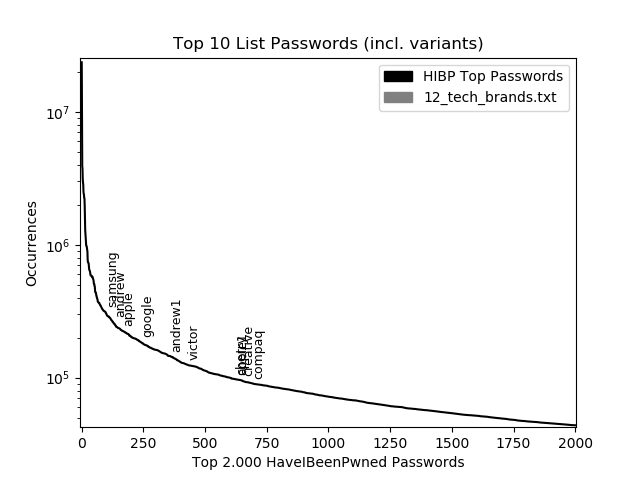

#### 13_en_fruit.txt <a name="13_en_fruit"></a>

Ohne Permutationen:

```
1 - {'name': 'apple', 'occurrences': 228761, 'permutator': 'no_permutator'}
2 - {'name': 'orange', 'occurrences': 192223, 'permutator': 'no_permutator'}
3 - {'name': 'banana', 'occurrences': 156612, 'permutator': 'no_permutator'}
4 - {'name': 'cherry', 'occurrences': 98069, 'permutator': 'no_permutator'}
5 - {'name': 'pumpkin', 'occurrences': 83257, 'permutator': 'no_permutator'}
6 - {'name': 'strawberry', 'occurrences': 72365, 'permutator': 'no_permutator'}
7 - {'name': 'pineapple', 'occurrences': 42220, 'permutator': 'no_permutator'}
8 - {'name': 'blackberry', 'occurrences': 39699, 'permutator': 'no_permutator'}
9 - {'name': 'watermelon', 'occurrences': 35271, 'permutator': 'no_permutator'}
10 - {'name': 'coconut', 'occurrences': 30617, 'permutator': 'no_permutator'}
```

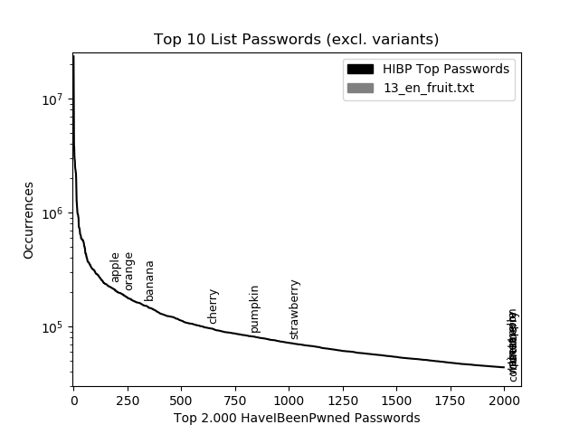

Mit Permutationen:

```
1 - {'name': 'apple', 'occurrences': 228761, 'permutator': 'no_permutator'}
2 - {'name': 'orange', 'occurrences': 192223, 'permutator': 'no_permutator'}
3 - {'name': 'banana', 'occurrences': 156612, 'permutator': 'no_permutator'}
4 - {'name': 'cherry', 'occurrences': 98069, 'permutator': 'no_permutator'}
5 - {'name': 'apple1', 'occurrences': 97817, 'permutator': 'number'}
6 - {'name': 'orange1', 'occurrences': 89079, 'permutator': 'number'}
7 - {'name': 'pumpkin', 'occurrences': 83257, 'permutator': 'no_permutator'}
8 - {'name': 'strawberry', 'occurrences': 72365, 'permutator': 'no_permutator'}
9 - {'name': 'cherry1', 'occurrences': 61462, 'permutator': 'number'}
10 - {'name': 'banana1', 'occurrences': 61210, 'permutator': 'number'}
```

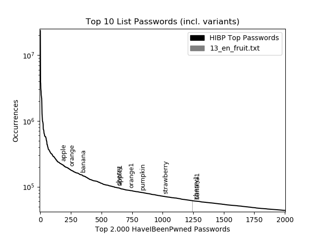

#### 14_en_drinks.txt <a name="14_en_drinks"></a>

Ohne Permutationen:

```
1 - {'name': 'orange', 'occurrences': 192223, 'permutator': 'no_permutator'}
2 - {'name': 'strawberry', 'occurrences': 72365, 'permutator': 'no_permutator'}
3 - {'name': 'fantasy', 'occurrences': 50878, 'permutator': 'no_permutator'}
4 - {'name': 'pineapple', 'occurrences': 42220, 'permutator': 'no_permutator'}
5 - {'name': 'aquarius', 'occurrences': 38486, 'permutator': 'no_permutator'}
6 - {'name': 'pepsi', 'occurrences': 26167, 'permutator': 'no_permutator'}
7 - {'name': 'sprite', 'occurrences': 25822, 'permutator': 'no_permutator'}
8 - {'name': 'beverly', 'occurrences': 23041, 'permutator': 'no_permutator'}
9 - {'name': 'shasta', 'occurrences': 20738, 'permutator': 'no_permutator'}
10 - {'name': 'squirt', 'occurrences': 19961, 'permutator': 'no_permutator'}
```

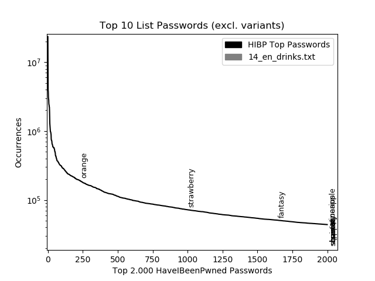

Mit Permutationen:

```
1 - {'name': 'orange', 'occurrences': 192223, 'permutator': 'no_permutator'}
2 - {'name': 'orange1', 'occurrences': 89079, 'permutator': 'number'}
3 - {'name': 'strawberry', 'occurrences': 72365, 'permutator': 'no_permutator'}
4 - {'name': 'pepsi1', 'occurrences': 54985, 'permutator': 'number'}
5 - {'name': 'fantasy', 'occurrences': 50878, 'permutator': 'no_permutator'}
6 - {'name': 'pineapple', 'occurrences': 42220, 'permutator': 'no_permutator'}
7 - {'name': 'aquarius', 'occurrences': 38486, 'permutator': 'no_permutator'}
8 - {'name': 'pepsi', 'occurrences': 26167, 'permutator': 'no_permutator'}
9 - {'name': 'pineapple1', 'occurrences': 25904, 'permutator': 'number'}
10 - {'name': 'sprite', 'occurrences': 25822, 'permutator': 'no_permutator'}
```

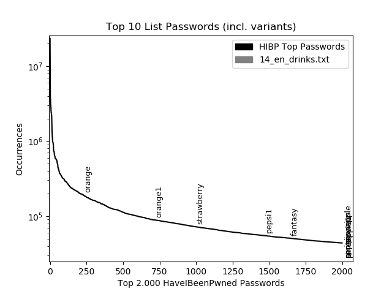

#### 15_en_food.txt <a name="15_en_food"></a>

Ohne Permutationen:

```
1 - {'name': 'snickers', 'occurrences': 85831, 'permutator': 'no_permutator'}
2 - {'name': 'cupcake', 'occurrences': 56853, 'permutator': 'no_permutator'}
3 - {'name': 'skittles', 'occurrences': 52466, 'permutator': 'no_permutator'}
4 - {'name': 'goldfish', 'occurrences': 46657, 'permutator': 'no_permutator'}
5 - {'name': 'chiquita', 'occurrences': 22720, 'permutator': 'no_permutator'}
6 - {'name': 'tyson', 'occurrences': 16946, 'permutator': 'no_permutator'}
7 - {'name': 'pringles', 'occurrences': 13594, 'permutator': 'no_permutator'}
8 - {'name': 'oreo', 'occurrences': 10785, 'permutator': 'no_permutator'}
9 - {'name': 'ortega', 'occurrences': 8655, 'permutator': 'no_permutator'}
10 - {'name': 'nestle', 'occurrences': 8614, 'permutator': 'no_permutator'}
```

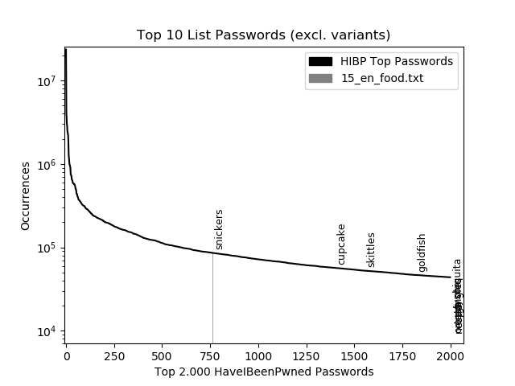

Mit Permutationen:

```
1 - {'name': 'snickers', 'occurrences': 85831, 'permutator': 'no_permutator'}
2 - {'name': 'cupcake', 'occurrences': 56853, 'permutator': 'no_permutator'}
3 - {'name': 'skittles', 'occurrences': 52466, 'permutator': 'no_permutator'}
4 - {'name': 'cupcake1', 'occurrences': 51774, 'permutator': 'number'}
5 - {'name': 'snickers1', 'occurrences': 51581, 'permutator': 'number'}
6 - {'name': 'goldfish', 'occurrences': 46657, 'permutator': 'no_permutator'}
7 - {'name': 'skittles1', 'occurrences': 41736, 'permutator': 'number'}
8 - {'name': 'tyson1', 'occurrences': 28317, 'permutator': 'number'}
9 - {'name': 'goldfish1', 'occurrences': 23794, 'permutator': 'number'}
10 - {'name': 'chiquita', 'occurrences': 22720, 'permutator': 'no_permutator'}
```

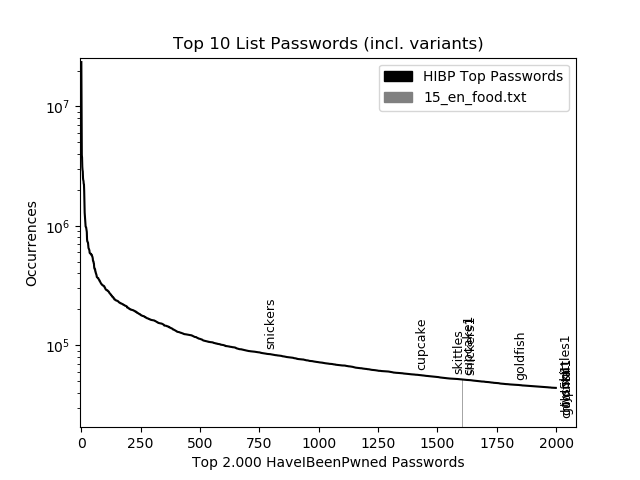

## Darstellung der Top 20 Lemmas <a name="top_20_lemmas"></a>

#### Nomen <a name="top_20_lemmas_nomen"></a>

Ohne Permutationen:

```
(1)     password: 3.730.471
(2)     monkey: 987.676
(3)     dragon: 977.231
(4)     tinkle: 587.352
(5)     computer: 486.169
(6)     princess: 484.475
(7)     football: 432.011
(8)     sunshine: 412.385
(9)     love: 347.508
(10)     shadow: 343.769
(11)     superman: 340.846
(12)     baseball: 322.854
(13)     killer: 320.366
(14)     master: 316.648
(15)     soccer: 310.446
(16)     lovely: 271.107
(17)     hello: 253.581
(18)     hunter: 246.847
(19)     welcome: 245.735
(20)     secret: 235.493
```

Mit Permutationen:

```
(1)     password: 3.730.471
(2)     password1: 2.413.945
(3)     monkey: 987.676
(4)     dragon: 977.231
(5)     123456a: 974.581
(6)     a123456: 683.974
(7)     target123: 589.429
(8)     tinkle: 587.352
(9)     computer: 486.169
(10)     princess: 484.475
(11)     12345a: 450.497
(12)     football: 432.011
(13)     sunshine: 412.385
(14)     princess1: 365.068
(15)     passer2009: 352.009
(16)     love: 347.508
(17)     shadow: 343.769
(18)     superman: 340.846
(19)     football1: 336.951
(20)     love123: 334.811
```

#### Verben  <a name="top_20_lemmas_verben"></a>

Ohne Permutationen:

```
(1)     monkey: 987.676
(2)     tinkle: 587.352
(3)     love: 347.508
(4)     shadow: 343.769
(5)     master: 316.648
(6)     welcome: 245.735
(7)     mother: 229.628
(8)     purple: 228.469
(9)     summer: 214.360
(10)     flower: 213.702
(11)     butterfly: 205.346
(12)     pepper: 195.676
(13)     google: 186.782
(14)     ginger: 183.636
(15)     school: 171.954
(16)     yellow: 167.967
(17)     cheese: 167.781
(18)     silver: 149.909
(19)     thunder: 111.099
(20)     cooper: 97.466
```

Mit Permutationen:

```
(1)     monkey: 987.676
(2)     target123: 589.429
(3)     tinkle: 587.352
(4)     love: 347.508
(5)     shadow: 343.769
(6)     love123: 334.811
(7)     monkey1: 325.065
(8)     master: 316.648
(9)     welcome: 245.735
(10)     bitch1: 239.947
(11)     mother: 229.628
(12)     purple: 228.469
(13)     summer: 214.360
(14)     flower: 213.702
(15)     number1: 213.577
(16)     butterfly: 205.346
(17)     pepper: 195.676
(18)     google: 186.782
(19)     ginger: 183.636
(20)     shadow1: 182.203
```

#### Adjektive <a name="top_20_lemmas_adjektive"></a>

Ohne Permutationen:

```
(1)     master: 316.648
(2)     lovely: 271.107
(3)     welcome: 245.735
(4)     secret: 235.493
(5)     purple: 228.469
(6)     whatever: 194.192
(7)     orange: 192.223
(8)     junior: 191.076
(9)     ginger: 183.636
(10)     snoopy: 175.231
(11)     yellow: 167.967
(12)     christian: 166.132
(13)     peanut: 161.655
(14)     chicken: 151.767
(15)     silver: 149.909
(16)     pretty: 113.229
(17)     beautiful: 110.111
(18)     sexy: 106.092
(19)     precious: 100.619
(20)     pussy: 99.549
```

Mit Permutationen:

```
(1)     master: 316.648
(2)     lovely: 271.107
(3)     welcome: 245.735
(4)     secret: 235.493
(5)     purple: 228.469
(6)     whatever: 194.192
(7)     orange: 192.223
(8)     junior: 191.076
(9)     ginger: 183.636
(10)     snoopy: 175.231
(11)     yellow: 167.967
(12)     christian: 166.132
(13)     peanut: 161.655
(14)     red123: 160.467
(15)     happy1: 159.821
(16)     chicken: 151.767
(17)     welcome1: 150.463
(18)     silver: 149.909
(19)     lucky1: 149.471
(20)     purple1: 145.571
```

#### Adverben <a name="top_20_lemmas_adverben"></a>

Ohne Permutationen:

```
(1)     forever: 201.789
(2)     nothing: 120.426
(3)     pretty: 113.229
(4)     precious: 100.619
(5)     never: 73.633
(6)     please: 69.729
(7)     sweet: 66.355
(8)     super: 59.311
(9)     little: 44.330
(10)     always: 38.945
(11)     good: 37.495
(12)     fucking: 34.851
(13)     best: 33.554
(14)     underground: 30.263
(15)     sharp: 28.844
(16)     dingdong: 27.382
(17)     counter: 26.702
(18)     verbatim: 26.035
(19)     rough: 25.585
(20)     free: 25.297
```

Mit Permutationen:

```
(1)     forever: 201.789
(2)     nothing: 120.426
(3)     super123: 119.486
(4)     pretty: 113.229
(5)     precious: 100.619
(6)     forever1: 87.295
(7)     pretty1: 83.779
(8)     sweet1: 79.300
(9)     never: 73.633
(10)     please: 69.729
(11)     precious1: 68.369
(12)     sweet: 66.355
(13)     super: 59.311
(14)     sweet16: 56.972
(15)     little1: 48.339
(16)     super1: 48.216
(17)     forever21: 45.342
(18)     little: 44.330
(19)     nothing1: 43.693
(20)     maddog: 39.771
```

## Darstellung der Top 10 Synsets pro Level (nach Gesamtsumme) <a name="top_10_synsets"></a>

Gemessen an der Gesamtsumme der Vorkommnisse (Summe des Synsets selbst sowie allen daran angehängten Kindern, `total_hits = this_hits + hits_below`).

#### Nomen <a name="top_10_synsets_nomen"></a>

```
Top 10 synset for level 0:
        1 - entity.n.01: 1.162.482.592

Top 10 synset for level 1:
        1 - physical_entity.n.01: 666.305.156
        2 - abstraction.n.06: 495.962.131
        3 - thing.n.08: 212.865

Top 10 synset for level 2:
        1 - object.n.01: 378.815.139
        2 - causal_agent.n.01: 172.790.040
        3 - psychological_feature.n.01: 139.497.685
        4 - measure.n.02: 119.727.113
        5 - matter.n.03: 86.710.926
        6 - attribute.n.02: 82.191.973
        7 - communication.n.02: 80.194.624
        8 - relation.n.01: 41.611.158
        9 - group.n.01: 32.583.570
        10 - process.n.06: 15.515.872

Top 10 synset for level 3:
        1 - whole.n.02: 353.844.890
        2 - person.n.01: 154.565.758
        3 - definite_quantity.n.01: 99.066.817
        4 - event.n.01: 95.683.594
        5 - cognition.n.01: 43.260.837
        6 - state.n.02: 37.677.389
        7 - substance.n.07: 35.418.352
        8 - part.n.01: 31.938.060
        9 - substance.n.01: 30.122.532
        10 - signal.n.01: 26.510.846

Top 10 synset for level 4:
        1 - living_thing.n.01: 225.162.771
        2 - artifact.n.01: 113.738.345
        3 - number.n.02: 83.961.682
        4 - act.n.02: 73.405.364
        5 - symbol.n.01: 24.166.354
        6 - content.n.05: 21.489.658
        7 - food.n.01: 18.544.382
        8 - material.n.01: 17.091.811
        9 - food.n.02: 16.150.659
        10 - unit_of_measurement.n.01: 15.095.967

Top 10 synset for level 5:
        1 - organism.n.01: 224.847.406
        2 - integer.n.01: 78.080.132
        3 - instrumentality.n.03: 62.052.337
        4 - activity.n.01: 43.252.435
        5 - written_symbol.n.01: 21.787.470
        6 - action.n.01: 14.445.601
        7 - structure.n.01: 13.273.325
        8 - color.n.01: 9.945.662
        9 - plant_part.n.01: 9.614.709
        10 - identification.n.02: 8.988.847

Top 10 synset for level 6:
        1 - digit.n.01: 55.504.810
        2 - animal.n.01: 47.547.427
        3 - device.n.01: 24.895.638
        4 - large_integer.n.01: 22.560.401
        5 - character.n.08: 21.160.403
        6 - plant.n.02: 21.139.769
        7 - diversion.n.01: 15.841.174
        8 - equipment.n.01: 12.698.901
        9 - change.n.03: 10.423.451
        10 - game.n.01: 9.361.957

Top 10 synset for level 7:
        1 - chordate.n.01: 36.061.337
        2 - six.n.01: 24.078.168
        3 - vascular_plant.n.01: 20.770.825
        4 - letter.n.02: 20.149.335
        5 - sport.n.01: 13.108.312
        6 - reproductive_structure.n.01: 8.526.216
        7 - nine.n.01: 8.290.437
        8 - athletic_game.n.01: 7.764.025
        9 - game_equipment.n.01: 7.119.727
        10 - vehicle.n.01: 6.888.884

Top 10 synset for level 8:
        1 - vertebrate.n.01: 36.060.272
        2 - woody_plant.n.01: 9.513.468
        3 - fruit.n.01: 7.405.633
        4 - outdoor_game.n.01: 6.313.831
        5 - herb.n.01: 5.506.934
        6 - arthropod.n.01: 4.264.914
        7 - ball.n.01: 4.236.741
        8 - a.n.06: 4.142.817
        9 - contact_sport.n.01: 4.126.633
        10 - recording.n.03: 3.259.110

Top 10 synset for level 9:
        1 - mammal.n.01: 19.392.926
        2 - bird.n.01: 7.128.078
        3 - field_game.n.01: 6.066.065
        4 - tree.n.01: 5.277.352
        5 - aquatic_vertebrate.n.01: 4.855.558
        6 - shrub.n.01: 4.105.681
        7 - insect.n.01: 3.440.118
        8 - football.n.01: 3.349.826
        9 - sound_recording.n.01: 3.209.463
        10 - reptile.n.01: 3.176.032

Top 10 synset for level 10:
        1 - placental.n.01: 18.973.945
        2 - fish.n.01: 4.849.646
        3 - angiospermous_tree.n.01: 3.299.404
        4 - phonograph_record.n.01: 3.154.069
        5 - diapsid.n.01: 2.760.277
        6 - passerine.n.01: 2.567.362
        7 - flower.n.01: 2.369.389
        8 - light.n.01: 2.070.731
        9 - lepidopterous_insect.n.01: 1.814.934
        10 - dragon.n.01: 1.735.109

Top 10 synset for level 11:
        1 - carnivore.n.01: 7.789.518
        2 - ungulate.n.01: 4.617.641
        3 - bony_fish.n.01: 3.702.059
        4 - seventy-eight.n.02: 3.118.186
        5 - primate.n.02: 2.942.929
        6 - fruit_tree.n.01: 2.349.000
        7 - oscine.n.01: 2.195.313
        8 - saurian.n.01: 1.965.386
        9 - baseball.n.01: 1.696.707
        10 - butterfly.n.01: 1.566.677

Top 10 synset for level 12:
        1 - feline.n.01: 3.713.473
        2 - teleost_fish.n.01: 3.700.997
        3 - odd-toed_ungulate.n.01: 2.839.856
        4 - canine.n.02: 2.670.197
        5 - monkey.n.01: 2.317.059
        6 - lizard.n.01: 1.965.113
        7 - even-toed_ungulate.n.01: 1.777.714
        8 - cetacean.n.01: 1.339.365
        9 - lycaenid.n.01: 930.348
        10 - anseriform_bird.n.01: 825.091

Top 10 synset for level 13:
        1 - equine.n.01: 2.804.735
        2 - spiny-finned_fish.n.01: 2.349.172
        3 - cat.n.01: 2.232.516
        4 - agamid.n.01: 1.731.126
        5 - ruminant.n.01: 1.544.655
        6 - big_cat.n.01: 1.464.306
        7 - whale.n.02: 1.335.874
        8 - soft-finned_fish.n.01: 1.265.699
        9 - bitch.n.04: 860.847
        10 - blue.n.07: 764.738

Top 10 synset for level 14:
        1 - percoid_fish.n.01: 2.197.121
        2 - dragon.n.04: 1.727.214
        3 - horse.n.01: 1.545.313
        4 - toothed_whale.n.01: 1.309.372
        5 - bovid.n.01: 1.234.720
        6 - ass.n.03: 1.169.618
        7 - cypriniform_fish.n.01: 712.113
        8 - wildcat.n.03: 577.997
        9 - tiger.n.02: 527.983
        10 - sea_duck.n.01: 372.341

Top 10 synset for level 15:
        1 - dolphin.n.02: 1.307.928
        2 - pony.n.01: 732.280
        3 - scombroid.n.01: 728.271
        4 - jack.n.12: 598.471
        5 - carangid_fish.n.01: 454.568
        6 - topminnow.n.01: 423.008
        7 - cougar.n.01: 374.734
        8 - scoter.n.01: 363.561
        9 - goat.n.01: 331.606
        10 - dolphinfish.n.02: 319.787

Top 10 synset for level 16:
        1 - killer_whale.n.01: 976.021
        2 - mustang.n.01: 700.446
        3 - mackerel.n.02: 461.759
        4 - jack.n.11: 439.524
        5 - mollie.n.01: 422.432
        6 - cattle.n.01: 271.174
        7 - billy.n.02: 226.831
        8 - swordfish.n.02: 152.650
        9 - goldfish.n.01: 119.685
        10 - ram.n.05: 98.336

Top 10 synset for level 17:
        1 - spanish_mackerel.n.02: 221.108
        2 - chub_mackerel.n.01: 215.246
        3 - runner.n.10: 107.189
        4 - beef.n.01: 81.851
        5 - bronco.n.01: 75.067
        6 - charger.n.01: 74.218
        7 - cow.n.01: 52.530
        8 - bull.n.01: 40.070
        9 - marlin.n.01: 37.222
        10 - walleye.n.02: 29.869

Top 10 synset for level 18:
        1 - sierra.n.02: 194.399
        2 - longhorn.n.01: 57.087
        3 - springer.n.02: 27.449
        4 - cero.n.01: 21.428
        5 - jersey.n.05: 5.851
        6 - king_mackerel.n.01: 5.281
        7 - aberdeen_angus.n.01: 3.670
        8 - gaur.n.01: 3.628
        9 - durham.n.02: 2.696
        10 - hereford.n.01: 2.071
```

#### Verben <a name="top_10_synsets_verben"></a>

```
Top 10 synset for level 0:
        1 - change.v.01: 22.343.915
        2 - change.v.02: 20.510.769
        3 - move.v.02: 17.263.020
        4 - act.v.01: 16.637.510
        5 - travel.v.01: 14.993.990
        6 - make.v.03: 11.812.898
        7 - think.v.03: 7.965.000
        8 - connect.v.01: 6.955.679
        9 - move.v.03: 5.970.125
        10 - touch.v.01: 5.893.531

Top 10 synset for level 1:
        1 - interact.v.01: 12.129.543
        2 - evaluate.v.02: 4.807.659
        3 - discolor.v.03: 4.247.522
        4 - join.v.04: 4.143.918
        5 - give.v.03: 3.989.001
        6 - sound.v.02: 3.631.517
        7 - put.v.01: 3.300.921
        8 - change_magnitude.v.01: 3.251.531
        9 - better.v.02: 3.180.122
        10 - handle.v.04: 3.070.616

Top 10 synset for level 2:
        1 - communicate.v.02: 8.860.608
        2 - copulate.v.01: 3.866.117
        3 - manipulate.v.02: 3.045.322
        4 - increase.v.01: 2.676.310
        5 - cut.v.01: 2.641.871
        6 - treat.v.01: 2.002.390
        7 - convey.v.03: 1.655.759
        8 - supply.v.01: 1.607.462
        9 - hit.v.01: 1.536.430
        10 - declare.v.01: 1.511.541

Top 10 synset for level 3:
        1 - inform.v.01: 3.962.644
        2 - sleep_together.v.01: 3.383.603
        3 - tamper.v.01: 2.175.359
        4 - communicate.v.01: 1.652.791
        5 - grow.v.02: 1.552.091
        6 - talk.v.02: 1.513.816
        7 - permit.v.01: 1.256.227
        8 - aim.v.01: 1.088.584
        9 - record.v.01: 1.045.670
        10 - talk.v.01: 1.037.088

Top 10 synset for level 4:
        1 - tell.v.02: 2.176.063
        2 - develop.v.10: 1.215.074
        3 - request.v.01: 1.145.263
        4 - refute.v.01: 963.651
        5 - target.v.01: 815.406
        6 - authorize.v.01: 734.251
        7 - victimize.v.01: 663.820
        8 - chat_up.v.01: 653.327
        9 - welcome.v.02: 600.061
        10 - encourage.v.02: 555.594

Top 10 synset for level 5:
        1 - impart.v.01: 1.069.697
        2 - oppose.v.06: 929.745
        3 - ask.v.02: 674.349
        4 - bloom.v.01: 667.667
        5 - question.v.03: 461.015
        6 - deceive.v.01: 452.583
        7 - bespeak.v.01: 433.807
        8 - legislate.v.01: 426.357
        9 - unwrap.v.02: 363.960
        10 - hash_out.v.01: 338.265

Top 10 synset for level 6:
        1 - convey.v.01: 1.061.990
        2 - protest.v.02: 826.559
        3 - request.v.02: 660.162
        4 - mark.v.02: 354.873
        5 - examine.v.04: 344.229
        6 - cheat.v.03: 291.567
        7 - back.v.01: 198.649
        8 - spring.v.05: 137.331
        9 - rede.v.02: 124.350
        10 - marcel.v.01: 114.607

Top 10 synset for level 7:
        1 - express.v.01: 548.424
        2 - demonstrate.v.04: 444.674
        3 - order.v.01: 391.054
        4 - quiz.v.01: 339.016
        5 - mean.v.01: 307.578
        6 - invite.v.04: 253.896
        7 - rebel.v.02: 180.015
        8 - fudge.v.01: 179.363
        9 - rebel.v.01: 147.307
        10 - champion.v.01: 134.346

Top 10 synset for level 8:
        1 - smile.v.02: 292.609
        2 - challenge.v.02: 238.500
        3 - command.v.02: 223.122
        4 - call.v.05: 109.277
        5 - drive.v.11: 109.183
        6 - typify.v.02: 88.866
        7 - aim.v.06: 83.669
        8 - give_voice.v.01: 76.885
        9 - stress.v.01: 50.944
        10 - push.v.02: 40.939

Top 10 synset for level 9:
        1 - forbid.v.01: 169.790
        2 - action.v.01: 124.190
        3 - embody.v.02: 84.687
        4 - summon.v.02: 50.583
        5 - provoke.v.03: 47.708
        6 - bull.v.01: 33.899
        7 - frame.v.04: 25.649
        8 - question.v.01: 25.299
        9 - charge.v.18: 24.551
        10 - smack.v.02: 23.538

Top 10 synset for level 10:
        1 - outlaw.v.01: 112.355
        2 - entice.v.01: 40.632
        3 - bar.v.01: 33.245
        4 - buzz.v.04: 31.242
        5 - page.v.01: 16.568
        6 - ban.v.02: 14.697
        7 - foreground.v.01: 11.412
        8 - body.v.01: 10.326
        9 - exemplify.v.01: 3.983
        10 - overwhelm.v.02: 3.628

Top 10 synset for level 11:
        1 - ban.v.01: 16.885
        2 - hook.v.11: 16.436
        3 - call.v.22: 9.339
        4 - decoy.v.01: 4.467
        5 - bait.v.02: 2.772
        6 - tweedle.v.03: 1.931
        7 - seduce.v.02: 1.700
        8 - raise.v.21: 1.690
        9 - stool.v.01: 1.196
        10 - rumpus.v.01: 1.141

Top 10 synset for level 12:
        1 - embargo.v.01: 1.428
```

## Darstellung der Top 10 Synsets pro Level (nach Synsethits) <a name="top_10_this_synsets"></a>

Gemessen an der Gesamtsumme der Vorkommnisse (Ausschließlich Summe des Synsets selbst, `this_hits`).

#### Nomen <a name="top_10_this_synsets_nomen"></a>

```
Top 10 synset for level 0:
        1 - entity.n.01: 2.440

Top 10 synset for level 1:
        1 - thing.n.08: 20.064
        2 - abstraction.n.06: 250
        3 - physical_entity.n.01: 0

Top 10 synset for level 2:
        1 - change.n.06: 122.134
        2 - stinker.n.02: 32.020
        3 - horror.n.02: 20.546
        4 - thing.n.12: 20.064
        5 - set.n.02: 16.808
        6 - group.n.01: 16.148
        7 - matter.n.03: 12.611
        8 - whacker.n.01: 11.439
        9 - communication.n.02: 7.710
        10 - process.n.06: 7.469

Top 10 synset for level 3:
        1 - cheerfulness.n.01: 1.223.643
        2 - cause_of_death.n.01: 963.664
        3 - destiny.n.02: 411.119
        4 - power.n.05: 273.129
        5 - multitude.n.03: 244.478
        6 - citizenry.n.01: 230.986
        7 - people.n.01: 230.978
        8 - world.n.08: 230.897
        9 - body_of_water.n.01: 210.396
        10 - probability.n.01: 207.208

Top 10 synset for level 4:
        1 - killer.n.01: 1.173.502
        2 - trace.n.02: 1.016.654
        3 - child.n.03: 806.644
        4 - class.n.01: 709.087
        5 - second.n.01: 656.396
        6 - nothing.n.01: 633.280
        7 - baby_buster.n.01: 618.217
        8 - buster.n.04: 618.213
        9 - junior.n.03: 578.760
        10 - freedom.n.01: 557.944

Top 10 synset for level 5:
        1 - beloved.n.01: 2.992.237
        2 - saint.n.02: 1.402.500
        3 - ace.n.03: 1.263.643
        4 - victor.n.01: 1.104.470
        5 - demigod.n.01: 954.011
        6 - calculator.n.01: 852.597
        7 - overlord.n.01: 851.236
        8 - hunter.n.02: 773.929
        9 - blue.n.03: 764.738
        10 - eden.n.01: 700.302

Top 10 synset for level 6:
        1 - password.n.01: 8.332.496
        2 - love.n.02: 2.778.513
        3 - sexual_love.n.02: 2.591.867
        4 - love.n.01: 2.588.293
        5 - love.n.05: 2.588.293
        6 - imp.n.02: 2.323.871
        7 - princess.n.01: 1.577.542
        8 - hello.n.01: 1.366.815
        9 - tail.n.05: 1.005.740
        10 - shadow.n.07: 1.002.413

Top 10 synset for level 7:
        1 - six.n.01: 24.078.168
        2 - nine.n.01: 8.290.437
        3 - zero.n.02: 5.480.959
        4 - one.n.01: 4.643.025
        5 - twelve.n.01: 3.451.954
        6 - eight.n.01: 3.375.331
        7 - seven.n.01: 3.119.285
        8 - seventy-eight.n.01: 3.118.186
        9 - five.n.01: 2.882.187
        10 - love.n.04: 2.588.295

Top 10 synset for level 8:
        1 - a.n.06: 4.142.817
        2 - p.n.02: 1.447.313
        3 - apparition.n.03: 1.130.946
        4 - i.n.03: 1.119.036
        5 - q.n.01: 1.051.982
        6 - m.n.06: 1.027.415
        7 - fair_weather.n.01: 1.008.925
        8 - shadow.n.01: 1.002.413
        9 - computer.n.01: 836.489
        10 - baby.n.07: 790.949

Top 10 synset for level 9:
        1 - football.n.01: 1.697.187
        2 - football.n.02: 1.697.183
        3 - baseball.n.02: 1.185.548
        4 - shadow.n.04: 1.002.413
        5 - kitty.n.04: 1.002.041
        6 - master.n.07: 965.895
        7 - baby.n.06: 790.949
        8 - amobarbital_sodium.n.01: 765.513
        9 - kitten.n.01: 689.869
        10 - mystery.n.01: 646.567

Top 10 synset for level 10:
        1 - dragon.n.01: 1.728.514
        2 - soccer.n.01: 1.581.159
        3 - ma.n.01: 1.472.389
        4 - dad.n.01: 993.339
        5 - baby.n.04: 790.949
        6 - jasmine.n.01: 589.465
        7 - field_hockey.n.01: 576.375
        8 - flower.n.01: 572.816
        9 - issue.n.02: 540.177
        10 - capsicum.n.01: 538.353

Top 10 synset for level 11:
        1 - seventy-eight.n.02: 3.118.186
        2 - baseball.n.01: 1.185.548
        3 - sunlight.n.01: 1.071.393
        4 - hunter.n.04: 773.929
        5 - butterfly.n.02: 538.649
        6 - butterfly.n.01: 538.649
        7 - tall_mallow.n.01: 522.759
        8 - pink.n.02: 471.675
        9 - pass.n.07: 426.271
        10 - heather.n.01: 412.490

Top 10 synset for level 12:
        1 - monkey.n.01: 2.163.129
        2 - peanut.n.04: 619.906
        3 - chicken.n.02: 517.742
        4 - softball.n.02: 429.507
        5 - cherry.n.02: 370.658
        6 - water_scooter.n.01: 362.202
        7 - spider.n.03: 276.916
        8 - turtle.n.02: 260.997
        9 - elephant.n.01: 223.286
        10 - bear.n.01: 223.150

Top 10 synset for level 13:
        1 - bitch.n.04: 860.847
        2 - blue.n.07: 764.738
        3 - apple.n.02: 631.606
        4 - orange.n.03: 572.458
        5 - martin.n.05: 483.375
        6 - popcorn.n.01: 289.123
        7 - rabbit.n.01: 224.741
        8 - pigeon_hawk.n.01: 219.203
        9 - giant_panda.n.01: 194.239
        10 - lesser_panda.n.01: 193.765

Top 10 synset for level 14:
        1 - dragon.n.04: 1.727.214
        2 - tiger.n.02: 519.567
        3 - jaguar.n.01: 329.996
        4 - skate.n.02: 254.851
        5 - bunny.n.02: 218.141
        6 - horse.n.01: 135.768
        7 - ass.n.03: 127.104
        8 - homing_pigeon.n.01: 110.783
        9 - wildcat.n.03: 95.819
        10 - redhead.n.02: 90.528

Top 10 synset for level 15:
        1 - jack.n.12: 598.471
        2 - cougar.n.01: 374.734
        3 - scoter.n.01: 363.561
        4 - dolphinfish.n.02: 319.787
        5 - dolphin.n.02: 316.145
        6 - jennet.n.01: 278.963
        7 - panther.n.02: 196.770
        8 - domestic_ass.n.01: 153.226
        9 - hack.n.06: 148.481
        10 - elk.n.01: 134.232

Top 10 synset for level 16:
        1 - killer_whale.n.01: 976.021
        2 - mustang.n.01: 625.379
        3 - mollie.n.01: 422.432
        4 - jack.n.11: 313.230
        5 - billy.n.02: 226.831
        6 - swordfish.n.02: 152.650
        7 - goldfish.n.01: 114.965
        8 - ram.n.05: 98.336
        9 - american_bison.n.01: 93.566
        10 - wolffish.n.01: 83.608

Top 10 synset for level 17:
        1 - chub_mackerel.n.01: 215.246
        2 - runner.n.10: 107.189
        3 - bronco.n.01: 75.067
        4 - charger.n.01: 74.218
        5 - marlin.n.01: 37.184
        6 - bull.n.01: 33.899
        7 - walleye.n.02: 29.868
        8 - red_drum.n.01: 29.337
        9 - cow.n.01: 22.172
        10 - wheel_horse.n.01: 21.135

Top 10 synset for level 18:
        1 - sierra.n.02: 194.399
        2 - longhorn.n.01: 57.087
        3 - springer.n.02: 27.449
        4 - cero.n.01: 21.428
        5 - jersey.n.05: 5.851
        6 - king_mackerel.n.01: 5.281
        7 - aberdeen_angus.n.01: 3.670
        8 - gaur.n.01: 3.628
        9 - durham.n.02: 2.696
        10 - hereford.n.01: 2.071
```

#### Verben <a name="top_10_this_synsets_verben"></a>

```
Top 10 synset for level 0:
        1 - love.v.01: 2.588.293
        2 - guide.v.05: 457.034
        3 - happen.v.01: 434.942
        4 - spend.v.01: 427.465
        5 - pass.v.22: 426.271
        6 - thunder.v.03: 392.841
        7 - notice.v.02: 251.203
        8 - hold.v.14: 231.325
        9 - find.v.01: 225.157
        10 - cheer.v.03: 214.733

Top 10 synset for level 1:
        1 - love.v.02: 2.604.855
        2 - love.v.03: 2.588.293
        3 - putter.v.02: 2.542.498
        4 - gripe.v.01: 915.125
        5 - backbite.v.01: 860.891
        6 - master.v.04: 819.604
        7 - dominate.v.03: 763.227
        8 - summer.v.01: 760.524
        9 - master.v.01: 756.236
        10 - beget.v.01: 714.712

Top 10 synset for level 2:
        1 - shadow.v.02: 1.020.852
        2 - shadow.v.01: 1.002.413
        3 - purple.v.02: 873.531
        4 - purple.v.01: 873.502
        5 - blue.v.01: 764.738
        6 - overcome.v.02: 761.419
        7 - tinkle.v.01: 718.151
        8 - welcome.v.01: 599.129
        9 - green.v.01: 589.532
        10 - yellow.v.01: 571.600

Top 10 synset for level 3:
        1 - sleep_together.v.01: 3.265.482
        2 - tamper.v.01: 2.175.359
        3 - shadow.v.03: 1.008.467
        4 - pamper.v.01: 809.861
        5 - mother.v.01: 542.560
        6 - number.v.03: 540.525
        7 - butterfly.v.01: 538.649
        8 - number.v.06: 535.461
        9 - cheese.v.02: 522.737
        10 - pink.v.03: 471.675

Top 10 synset for level 4:
        1 - target.v.01: 803.825
        2 - chat_up.v.01: 639.925
        3 - welcome.v.02: 600.061
        4 - count.v.05: 543.705
        5 - butterfly.v.02: 538.649
        6 - authorize.v.01: 441.756
        7 - thunder.v.04: 320.740
        8 - talk_through_one's_hat.v.01: 313.484
        9 - digest.v.03: 307.134
        10 - smile.v.01: 292.609

Top 10 synset for level 5:
        1 - bloom.v.01: 667.651
        2 - legislate.v.01: 426.357
        3 - thunder.v.02: 328.818
        4 - kid.v.02: 298.513
        5 - score.v.02: 252.450
        6 - bob.v.05: 244.008
        7 - cheer.v.05: 229.030
        8 - cheer.v.01: 215.602
        9 - cheer.v.02: 214.688
        10 - frank.v.02: 189.858

Top 10 synset for level 6:
        1 - mark.v.02: 236.923
        2 - spring.v.05: 137.331
        3 - marcel.v.01: 114.607
        4 - placard.v.02: 97.288
        5 - chomp.v.01: 94.626
        6 - buffalo.v.01: 93.561
        7 - champ.v.01: 91.836
        8 - spill_the_beans.v.01: 89.183
        9 - bamboozle.v.01: 75.568
        10 - overcharge.v.01: 74.186

Top 10 synset for level 7:
        1 - demonstrate.v.04: 443.704
        2 - quiz.v.01: 339.016
        3 - rebel.v.02: 180.015
        4 - fudge.v.01: 172.181
        5 - rebel.v.01: 135.595
        6 - champion.v.01: 134.346
        7 - flash.v.04: 101.165
        8 - blaze.v.05: 96.304
        9 - kill.v.02: 83.526
        10 - express.v.01: 65.041

Top 10 synset for level 8:
        1 - smile.v.02: 292.609
        2 - drive.v.11: 109.183
        3 - aim.v.06: 83.669
        4 - give_voice.v.01: 37.129
        5 - stress.v.01: 31.770
        6 - command.v.02: 28.738
        7 - rush.v.03: 28.340
        8 - menace.v.02: 22.407
        9 - preach.v.02: 17.684
        10 - spell.v.02: 16.193

Top 10 synset for level 9:
        1 - action.v.01: 123.505
        2 - embody.v.02: 70.378
        3 - bull.v.01: 33.899
        4 - frame.v.04: 25.649
        5 - question.v.01: 25.299
        6 - smack.v.02: 23.538
        7 - defy.v.03: 20.708
        8 - charge.v.18: 20.417
        9 - ask.v.03: 14.094
        10 - beep.v.02: 11.603

Top 10 synset for level 10:
        1 - outlaw.v.01: 95.470
        2 - bar.v.01: 33.245
        3 - buzz.v.04: 31.242
        4 - page.v.01: 16.568
        5 - ban.v.02: 14.697
        6 - foreground.v.01: 11.412
        7 - body.v.01: 10.326
        8 - exemplify.v.01: 3.983
        9 - overwhelm.v.02: 3.628
        10 - demand.v.05: 3.461

Top 10 synset for level 11:
        1 - hook.v.11: 16.436
        2 - ban.v.01: 15.457
        3 - call.v.22: 9.339
        4 - decoy.v.01: 4.467
        5 - bait.v.02: 2.772
        6 - tweedle.v.03: 1.931
        7 - seduce.v.02: 1.700
        8 - raise.v.21: 1.690
        9 - stool.v.01: 1.196
        10 - rumpus.v.01: 1.141

Top 10 synset for level 12:
        1 - embargo.v.01: 1.428
```


